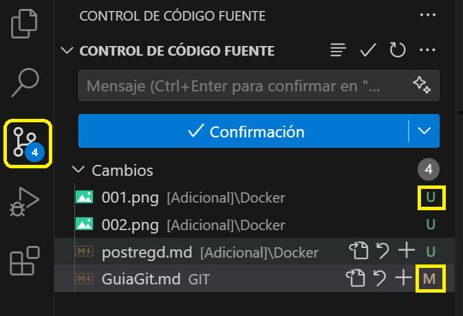
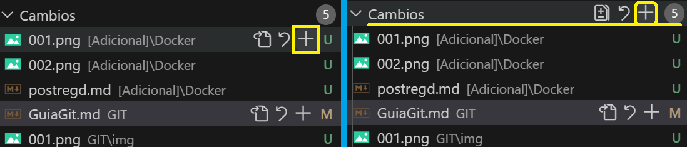
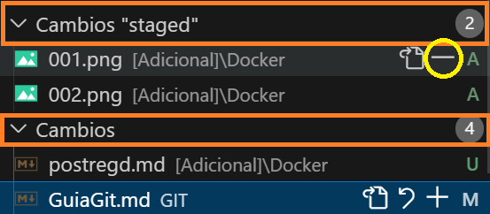
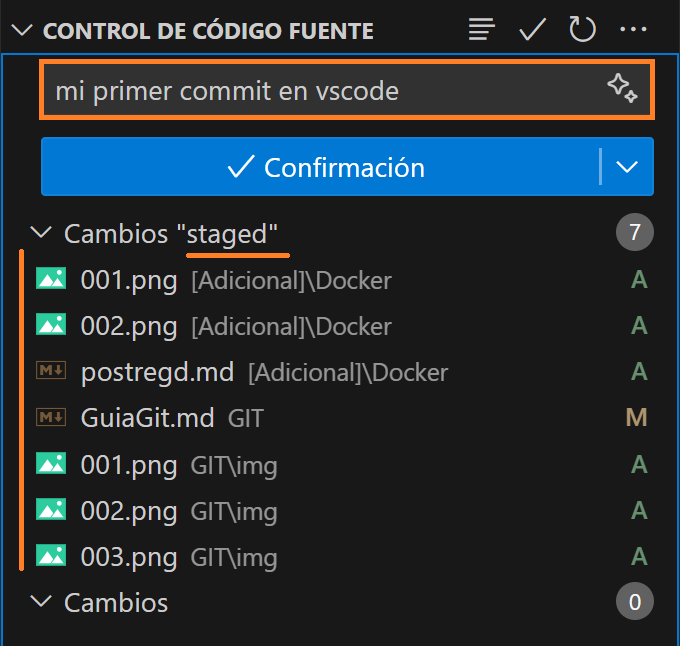
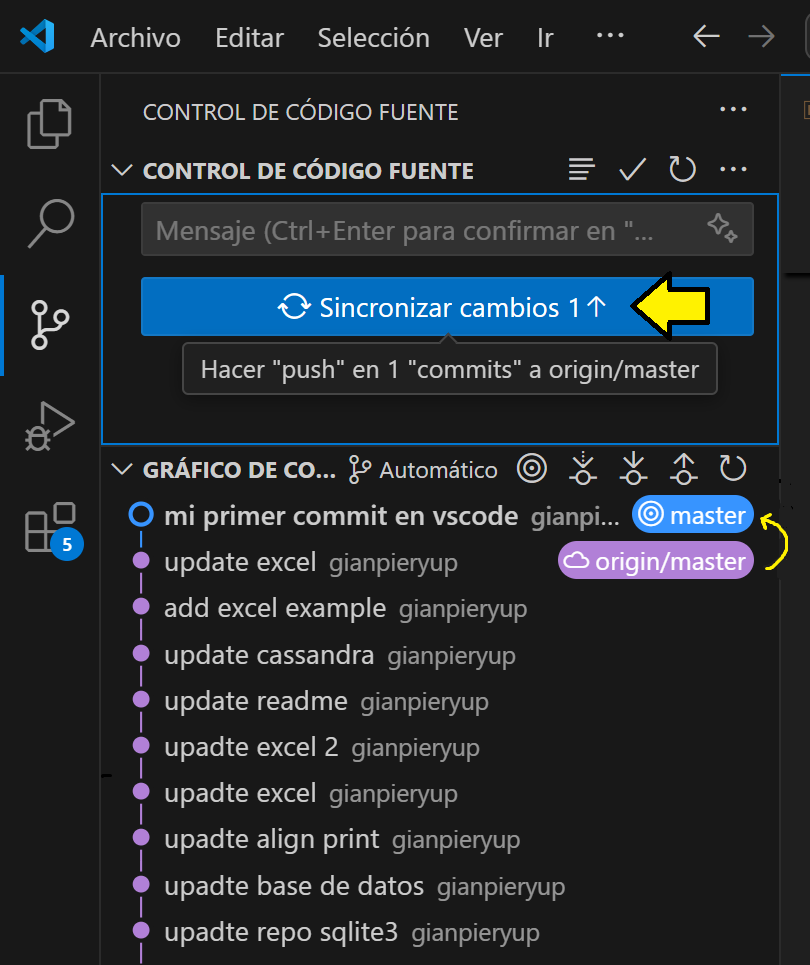
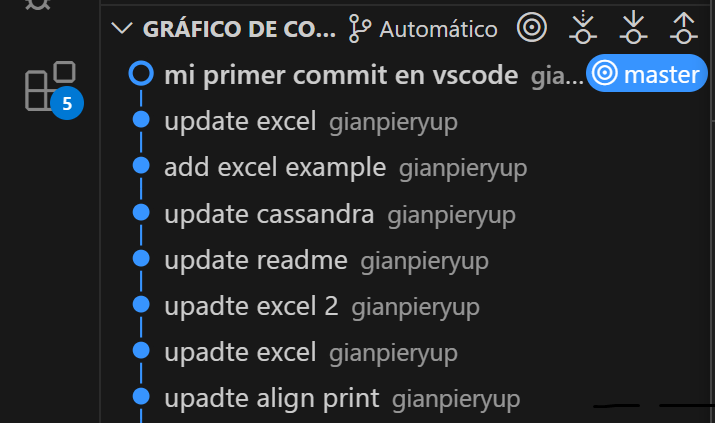
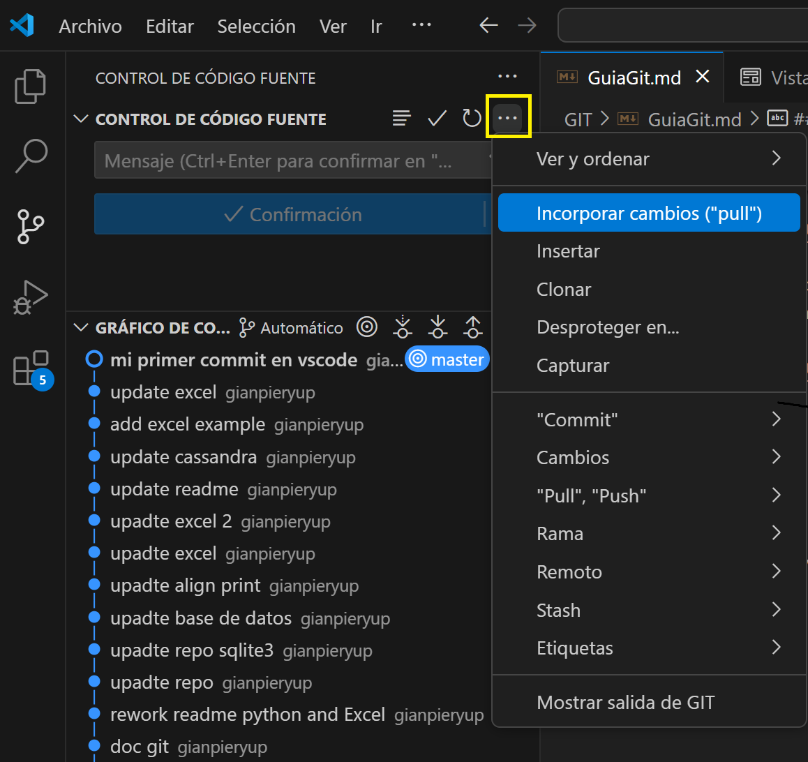
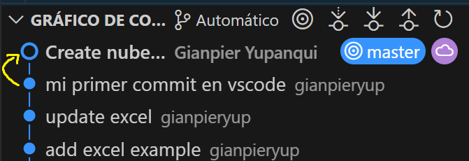

<div align="center">
	<code></code>
</div>

## ÍNDICE
<!-- TOC -->

- [1. Configuración Inicial](#1-configuración-inicial)
- [2. Flujo Básico de Trabajo](#2-flujo-básico-de-trabajo)
- [3. Comandos de Visualización](#3-comandos-de-visualización)
- [4. Deshacer Cambios](#4-deshacer-cambios)
- [5. Manejo de Conflictos (Merge)](#5-manejo-de-conflictos-merge)
- [6. Ramas (Branches)](#6-ramas-branches)
- [7. Git Stash](#7-git-stash)
- [8. Archivos a Ignorar (.gitignore)](#8-archivos-a-ignorar-gitignore)
- [9. Usando Git desde VSCode](#9-usando-git-desde-vscode)
- [10. Editor VIM](#10-editor-vim)

<!-- /TOC -->

---

## 1. Configuración Inicial

Antes de usar Git por primera vez, debes configurar tu identidad:

```bash
git config --global user.email "tu-email@ejemplo.com"
git config --global user.name "tu-usuario"
```

### Configurar VSCode como editor predeterminado

Para evitar usar el editor VIM y usar VSCode en su lugar:

```bash
git config --global core.editor "code --wait"
```

Esto hará que cuando Git necesite que edites un mensaje (como en `git commit` sin `-m`), se abra VSCode en lugar de VIM. (No me gusta VIM porque me olvido de los comandos)

---

## 2. Flujo Básico de Trabajo

### 2.1 Clonar un repositorio existente

```bash
git clone url/delrepo
```

Esto descarga una copia completa del repositorio a tu computadora.

### 2.2 Ver el estado de los archivos

Después de modificar archivos, puedes ver qué cambió con:

```bash
git status
```

Esto te mostrará:
- Archivos modificados
- Archivos nuevos
- Archivos preparados para commit

**Ejemplo de salida:**
```diff
On branch master
Your branch is up to date with 'origin/master'.

Changes not staged for commit:
  (use "git add <file>..." to update what will be committed)
  (use "git restore <file>..." to discard changes in working directory)
-        modified:   archivo.js

no changes added to commit (use "git add" and/or "git commit -a")
```

> 🚀 TIP: Lee lo que te dice Git, yo se que esta en ingles pero es muy intuitivo.


### 2.3 Preparar cambios (git add)

Los cambios deben ser "stagged" (preparados) antes de commitearlos:

```bash
# Agregar un archivo específico
git add archivo.js

# Agregar todos los cambios
git add .
```

Después de agregar, `git status` mostrará:
```diff
Changes to be committed:
  (use "git restore --staged <file>..." to unstage)
+        modified:   archivo.js
```

**Desmarcar cambios** (si te arrepentiste del add):
```bash
git restore --staged archivo.js
```

> 🚀 TIP: Esto no borra los cambios que hiciste, solo los desmarca para el próximo commit.

### 2.4 Guardar cambios (git commit)

Una vez preparados los cambios, crea un commit con un mensaje descriptivo:

```bash
git commit -m "Descripción breve de los cambios"
```

### 2.5 Actualizar antes de subir (git pull)

**MUY IMPORTANTE:** Antes de subir tus cambios, actualiza tu repositorio local:

```bash
git pull
```

Esto evita conflictos y asegura que tienes los últimos cambios del equipo.

### 2.6 Subir cambios (git push)

```bash
git push
```

### 2.7 Flujo completo recomendado

```bash
git add .
git commit -m "mensaje descriptivo"
git pull    # IMPORTANTE: actualizar antes de subir
git push
```

⚠️ **NO HACER:**
```bash
git commit
git push    # Puede dar error si no hiciste pull primero
```

---

## 3. Comandos de Visualización

### 3.1 Ver historial de commits

```bash
git log
```

Muestra todos los commits con su hash, autor, fecha y mensaje.

### 3.2 Ver diferencias en un archivo

```bash
git diff archivo.js
```

Muestra qué cambios hiciste en el archivo comparado con la última versión.

---

## 4. Deshacer Cambios

### 4.1 Revertir cambios en un archivo

Si modificaste un archivo pero quieres volver a la versión anterior:

```bash
git checkout -- archivo.js
```

⚠️ **ADVERTENCIA:** Esto perderá tus cambios sin posibilidad de recuperación.

### 4.2 Revertir un commit ya subido

Si hiciste un push que no querías:

```bash
# 1. Ver el historial para encontrar el hash del commit
git log

# 2. Revertir el commit específico
git revert <hash-del-commit>

# 3. Guardar y salir del editor VIM (ver sección 10)
# Presiona :wq y Enter

# 4. Subir el revert
git push
```

---

## 5. Manejo de Conflictos (Merge)

Cuando haces `git pull` y hay cambios en el mismo archivo por otra persona, ocurre un conflicto.

### 5.1 Proceso de resolución

```bash
git commit -m "mis cambios"
git pull
# Aparece conflicto
```

### 5.2 Resolver en VSCode

VSCode mostrará:
```
>> Mis cambios
<< Los otros cambios
```

Opciones:
- Aceptar mis cambios
- Aceptar los otros cambios
- Aceptar ambos

### 5.3 Finalizar el merge

```bash
git status          # Verás el archivo modificado
git add .           # Agregar la resolución
git commit -m "arreglé conflicto de merge"
git push
```

---

## 6. Ramas (Branches)

Las ramas permiten trabajar en paralelo sin afectar el código principal.

### 6.1 Ver ramas existentes

```bash
git branch
```

El `*` indica en qué rama estás actualmente.

### 6.2 Crear una nueva rama

```bash
git branch nombre-rama
```

### 6.3 Cambiar de rama

```bash
git checkout nombre-rama
```

### 6.4 Crear y cambiar en un solo comando

```bash
git checkout -b nombre-rama
```

---

## 7. Git Stash

`git stash` guarda temporalmente tus cambios sin commitear para poder trabajar en otra cosa y volver después.

[Documentación oficial](https://www.atlassian.com/es/git/tutorials/saving-changes/git-stash)

### 7.1 Guardar cambios temporalmente

```bash
git stash
```

Esto guarda tus cambios y deja el directorio de trabajo limpio.

### 7.2 Recuperar cambios guardados

```bash
git stash pop
```

Restaura los cambios del stash más reciente.

---

## 8. Archivos a Ignorar (.gitignore)

El archivo `.gitignore` indica qué archivos/carpetas NO deben subir al repositorio.

### 8.1 Para qué sirve

- Dependencias pesadas (node_modules)
- Archivos de configuración local (.env)
- Archivos temporales
- Compilados

### 8.2 Ejemplo de .gitignore

```javascript
// Archivos específicos
cosapesada.txt
algo.js

// Carpetas
node_modules
/rest/node_modules/
/backend/node_modules/

// Archivos de configuración
/backend/.env
```

> **TIP:** Las carpetas vacías se ignoran por defecto.

---

## 9. Usando Git desde VSCode

### 9.1 GIT STATUS

Sección de **CAMBIOS** muestra todos los archivos modificados.



- **M**: Modificación
- **U**: Nuevo archivo
- Flecha en reversa: Descartar modificaciones (se perderán)
- Click en archivo: Ver diferencias

### 9.2 GIT ADD

Clic en el símbolo `+` para preparar archivos específicos, o usar el botón superior para todos.



Los archivos pasan a la sección de **Cambios "staged"**.



### 9.3 GIT COMMIT

Escribe el mensaje de commit en el cuadro de texto y confirma.



### 9.4 GIT PUSH

Sube los commits al repositorio remoto.




### 9.5 GIT PULL

Actualiza tu repositorio local con cambios del servidor.




---

## 10. Editor VIM

Algunos comandos de Git abren el editor VIM. Aquí cómo usarlo:

### 10.1 Salir de VIM

1. Presiona `i` para entrar en modo insertar (si no lo estás)
2. Escribe tu mensaje (verás `--INSERTAR--` abajo)
3. Presiona `Esc` para salir del modo insertar
4. Escribe `:wq` y presiona `Enter` (w = write, q = quit)

### 10.2 Atajos útiles

- `Esc` + `:q!` + `Enter`: Salir sin guardar
- `Esc` + `:w` + `Enter`: Guardar sin salir
