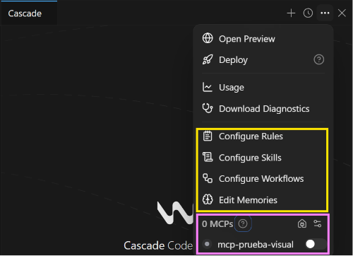

# IA Apuntes

## Acciones

Al desplegar el menú de tres puntos en la sesión de Cascade, verás el siguiente cuadro de opciones:



- Configure Rules
- Configure Skills
- Configure Workflows
- Edit Memories
- MCPs


## 1. Rules

Los **Rules** son archivos que definen reglas y comportamientos para el agente. El agente los tiene en consideración en cada interacción.

- **Ubicación:** En el repositorio (generalmente en `.agents/rules/nombre/RULE.md` o `.devin/rules/`).
- **Formato:** Archivos `.md`
- **Propósito:** Establecer directrices que el agente debe seguir en sus respuestas y acciones.
- **Ejemplo:** Reglas de estilo, formato de código, políticas de seguridad, No busques en esta ruta de S3 porque esta muy cargada, etc.


## 2. Skills

Un **Skill** es un bloque reutilizable de conocimiento o procedimiento operativo que le enseña a Devin **cómo hacer una tarea específica** dentro de un repositorio.

- **Ubicación:** En el repositorio (generalmente en `.agents/skills/nombre/SKILL.md` o `.devin/skills/`).
- **Activación:**
  - **Automática:** Devin escanea el repositorio y activa el Skill cuando detecta que la tarea lo requiere.
  - **Manual:** Invocándolo con `@skills:nombre` o `/nombre`.
- **Propósito:** Proporcionar contexto, comandos específicos, reglas de estilo o herramientas para resolver un tipo de problema.


## 3. Workflows

Un **Workflow** (o Playbook) es un flujo de trabajo estructurado paso a paso que define una secuencia **estricta y lineal** que Devin debe seguir de principio a fin.

- **Ubicación:** Generalmente en la interfaz/plataforma de Devin a nivel de organización o como un pipeline orquestado.
- **Activación:** Se asigna explícitamente al iniciar una sesión o mediante una automatización/desencadenador (trigger).
- **Propósito:** Garantizar que un proceso complejo con múltiples etapas se ejecute **exactamente igual** cada vez, reduciendo la improvisación.


### ⚖️ Regla General para Decidir

> **Crea un SKILL si:** Quieres enseñarle a Devin una capacidad/comando de tu repo para que la use cuando lo considere necesario (ej. *"Aprende a correr los tests de Cypress"*).
> **Crea un WORKFLOW si:** Quieres que Devin ejecute una rutina estructurada de múltiples pasos de principio a fin cada vez que inicie una tarea (ej. *"Revisa issues de Sentry, corrige el error, testea y envía PR"*).


## 4. Memorias

Las **Memorias** permiten proporcionar contexto específico al agente **durante una sesión**.

- **Duración:** Solo viven en la sesión actual, a diferencia de los **Rules** que son persistentes en el repositorio.
- **Propósito:** Compartir información temporal, contexto del proyecto actual, o instrucciones específicas para la sesión.
- **Uso típico:** Detalles sobre la tarea actual, preferencias momentáneas, o contexto que no necesita ser permanente.


## 5. MCP (Model Context Protocol)

El **MCP** es un protocolo de comunicación que permite conectar el agente con servidores externos, como Notion, GitHub, entre otros.

- **Funcionamiento:** Puedes escribir en el chat lo que deseas hacer y el agente lo entenderá y ejecutará mediante el MCP correspondiente.
- **Ejemplo:** Si tienes activado el MCP de Notion y solicitas crear una página con cierto contenido, el agente lo realizará automáticamente.
- **Instalación:** Puedes instalar MCPs desde el marketplace de Devin o agregar los que hayas creado tú mismo.

### Ejemplo de configuración

```json
{
  "mcpServers": {
    "mcp-prueba-visual": {
      "args": [
        "mcp-prueba/server.py"
      ],
      "command": "python",
      "disabled": true
    }
  }
}
```