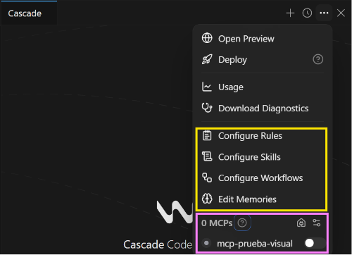
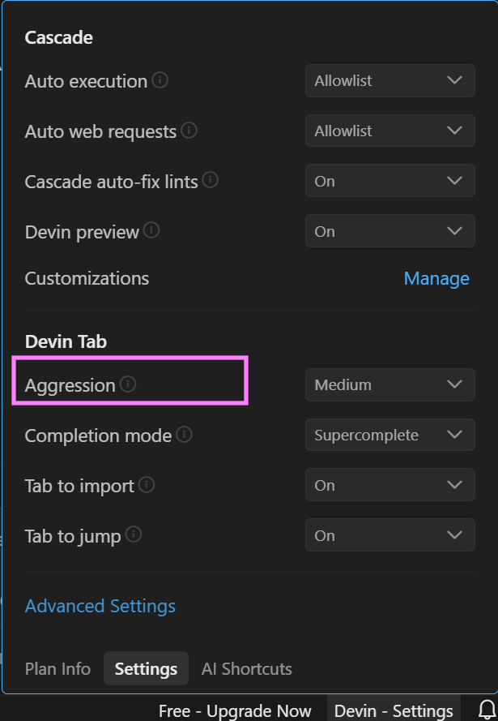

# IA Apuntes

## Acciones

Al desplegar el menú de tres puntos en la sesión de Cascade, verás el siguiente cuadro de opciones:




- Configure Rules
- Configure Skills
- Configure Workflows
- Edit Memories
- MCPs

---

## Aggression

En Devin-Settings: Tenemos varias opciones, entre ellas la Aggression.

Cuanto mas agresivo mas demora, pero da mejores resultados.
 Igualmente todo depende de la utilidad, si tienes bien definidos tus rules, quiza no necesitas poner a trabajar tanto la IA, si no que siga tus instrucciones




---

## 1. Rules

Los **Rules** son archivos que definen reglas y comportamientos para el agente. El agente los tiene en consideración en cada interacción.

- **Ubicación:** En el repositorio (generalmente en `.agents/rules/nombre/RULE.md` o `.devin/rules/`).
- **Formato:** Archivos `.md`
- **Propósito:** Establecer directrices que el agente debe seguir en sus respuestas y acciones.
- **Ejemplo:** Reglas de estilo, formato de código, políticas de seguridad, No busques en esta ruta de S3 porque esta muy cargada, etc.


## 2. Skills

Un **Skill** es un bloque reutilizable de conocimiento o procedimiento operativo que le enseña a Devin **cómo hacer una tarea específica** dentro de un repositorio.

- **Ubicación:** En el repositorio (generalmente en `.agents/skills/nombre/SKILL.md` o `.devin/skills/`).
- **Activación:**
  - **Automática:** Devin escanea el repositorio y activa el Skill cuando detecta que la tarea lo requiere.
  - **Manual:** Invocándolo con `@skills:nombre` o `/nombre`.
- **Propósito:** Proporcionar contexto, comandos específicos, reglas de estilo o herramientas para resolver un tipo de problema.


## 3. Workflows

Un **Workflow** (o Playbook) es un flujo de trabajo estructurado paso a paso que define una secuencia **estricta y lineal** que Devin debe seguir de principio a fin.

- **Ubicación:** Generalmente en la interfaz/plataforma de Devin a nivel de organización o como un pipeline orquestado.
- **Activación:** Se asigna explícitamente al iniciar una sesión o mediante una automatización/desencadenador (trigger).
- **Propósito:** Garantizar que un proceso complejo con múltiples etapas se ejecute **exactamente igual** cada vez, reduciendo la improvisación.


### ⚖️ Regla General para Decidir

> **Crea un SKILL si:** Quieres enseñarle a Devin una capacidad/comando de tu repo para que la use cuando lo considere necesario (ej. *"Aprende a correr los tests de Cypress"*).
> **Crea un WORKFLOW si:** Quieres que Devin ejecute una rutina estructurada de múltiples pasos de principio a fin cada vez que inicie una tarea (ej. *"Revisa issues de Sentry, corrige el error, testea y envía PR"*).


## 4. Memorias

Las **Memorias** permiten proporcionar contexto específico al agente **durante una sesión**.

- **Duración:** Solo viven en la sesión actual, a diferencia de los **Rules** que son persistentes en el repositorio.
- **Propósito:** Compartir información temporal, contexto del proyecto actual, o instrucciones específicas para la sesión.
- **Uso típico:** Detalles sobre la tarea actual, preferencias momentáneas, o contexto que no necesita ser permanente.


## 5. MCP (Model Context Protocol)

El **MCP** es un protocolo de comunicación que permite conectar el agente con servidores externos, como Notion, GitHub, entre otros.

- **Funcionamiento:** Puedes escribir en el chat lo que deseas hacer y el agente lo entenderá y ejecutará mediante el MCP correspondiente.
- **Ejemplo:** Si tienes activado el MCP de Notion y solicitas crear una página con cierto contenido, el agente lo realizará automáticamente.
- **Instalación:** Puedes instalar MCPs desde el marketplace de Devin o agregar los que hayas creado tú mismo.

### Ejemplo de configuración

```json
{
  "mcpServers": {
    "mcp-prueba-visual": {
      "args": [
        "mcp-prueba/server.py"
      ],
      "command": "python",
      "disabled": true
    }
  }
}
```

---

## 6. WebHooks

Un **WebHook** es un mecanismo de notificación automática que permite a una aplicación enviar datos en tiempo real a otra aplicación cuando ocurre un evento específico.

### Definición

Un WebHook es básicamente una "devolución de llamada HTTP" (HTTP callback). En lugar de que una aplicación tenga que preguntar constantemente a otra si hay novedades (polling), la segunda aplicación "avisa" a la primera enviando una petición HTTP POST a una URL predefinida cuando algo importante sucede.

### Características principales

- **URL de destino:** La aplicación que recibe las notificaciones debe exponer una URL pública donde el webhook envíe los datos
- **Eventos específicos:** Los webhooks se configuran para dispararse ante eventos concretos (ej. nuevo usuario, pago completado, error en el sistema)
- **Formato de datos:** Generalmente envían datos en formato JSON con información sobre el evento
- **Seguridad:** A menudo usan tokens o firmas digitales para verificar la autenticidad del webhook

### Ejemplo práctico

**Escenario:** Tienda online que notifica a un sistema de contabilidad cuando se realiza una venta

1. **Configuración:** La tienda online se configura para enviar webhooks a `https://contabilidad.ejemplo.com/api/ventas`
2. **Evento:** Un cliente realiza una compra de $100
3. **Webhook:** La tienda envía automáticamente:

```json
POST https://contabilidad.ejemplo.com/api/ventas
Content-Type: application/json
X-Webhook-Secret: mi-secreto-seguro

{
  "evento": "venta_completada",
  "venta_id": "12345",
  "monto": 100.00,
  "cliente": "juan@example.com",
  "productos": [
    {"id": "prod1", "cantidad": 2, "precio": 50.00}
  ],
  "timestamp": "2026-09-26T10:30:00Z"
}
```

4. **Procesamiento:** El sistema de contabilidad recibe la notificación, verifica la firma con el secreto, y registra automáticamente la venta en sus libros.

### Usos comunes

- **GitHub/GitLab:** Notificaciones cuando se crea un pull request, se mergea código, etc.
- **Stripe/PayPal:** Notificaciones de pagos, reembolsos, suscripciones
- **Slack/Discord:** Integraciones que publican mensajes cuando ocurren eventos
- **CI/CD:** Disparar builds cuando se hace push a un repositorio

---

## 7. Hooks de Devin vs WebHooks

Es importante distinguir entre **WebHooks** (el concepto general de integración web) y los **Hooks de Devin** (mecanismo específico de configuración del agente):

### WebHooks (Concepto general)
- **Definición:** Mecanismo de notificación HTTP entre aplicaciones web
- **Propósito:** Integración entre servicios externos diferentes
- **Ubicación:** Configuración en servicios web (GitHub, Stripe, etc.)
- **Ejecución:** Se disparan cuando ocurren eventos en aplicaciones externas
- **Ejemplo:** GitHub envía un webhook a tu servidor cuando alguien hace push

### Hooks de Devin (Configuración del agente)
- **Definición:** Scripts o comandos que se ejecutan en respuesta a eventos del ciclo de vida del agente
- **Propósito:** Controlar y personalizar el comportamiento de Devin durante una sesión
- **Ubicación:** Archivos de configuración en `.devin/hooks.v1.json` o similar
- **Ejecución:** Se disparan cuando Devin usa herramientas, inicia sesión, etc.
- **Ejemplo:** Ejecutar un script de validación antes de que Devin ejecute un comando de shell

### Diferencias clave

| Aspecto | WebHooks | Hooks de Devin |
|---------|----------|----------------|
| **Ámbito** | Integración entre aplicaciones web | Control del comportamiento del agente |
| **Comunicación** | HTTP (internet) | Ejecución local de comandos |
| **Eventos** | Eventos de aplicaciones externas | Eventos del ciclo de vida del agente |
| **Configuración** | En servicios web externos | En archivos de configuración del proyecto |
| **Uso típico** | Notificaciones entre servicios | Políticas, validaciones, logging |

