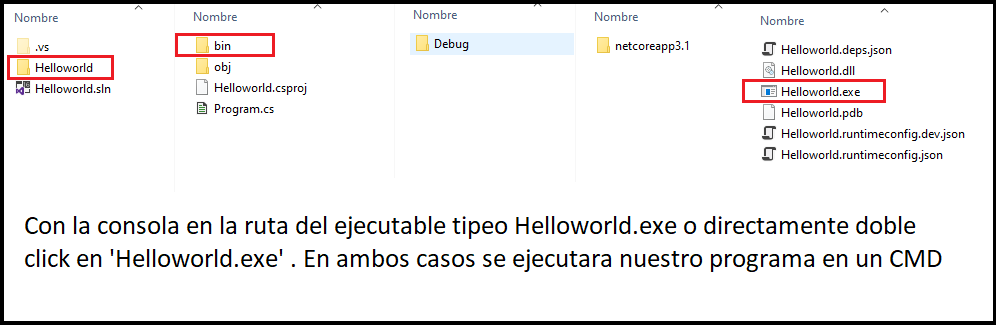

<div align="center">
	
</div>

# Como programar en C# (Deitel)

En un resumen con ejemplos del libro, obviamente como sabemos programar en otros lenguajes, avanzaremos rápido con los conceptos tradicionales y explicando la sintaxis.


### Consola

````c#
Console.Write("");//imprime y deja el cursor al final de la oracion		
Console.WriteLine("");// Imprime y deja el cursor en la siguiente linea
Console.ReadKey();//Mantiene abierta la consola hasta presionar un botom
Console.ReadLine();//Retorna lo que escriba el usuario, hasta presionar enter, tener en cuenta que la funcion devuelve un 'String'

                  
Console.WriteLine("El documento {0} de numero {1}", "Plus",10);
Esta notacion de imprimir varibles se entiende: 
{0} => "Plus", {1} => 10 
````

#### Secuencia de Escape

````
\n : nueva linea		\\ : barra invertida
\t : Tabulacion			\" : Comillas
````

#### Mostrar Cadenas con Formato

````c#
{0:C} ó {0:C2} //Devuelve formato en moneda,especifica la #decimales
{0:D} ó {0:D3} //Digitos enteros con signo negativo opcional,(")
{0:F} ó {0:F4} //Digitos integrales y decimales con signo negativo opcional
````

#### Control de la salida con formato 'Justificación'

````c#
//El parametro {0,3} asigna 3 caracteres para el resultado.
//La alineacion se justifica hacia la derecha
Console.WriteLine("{0,3}{1,10}",1,100);
Console.WirteLine("{0,3}{1,10}",10,1010);
Console.WirteLine("{0,3}{1,10}",100,10101);
````

| 1    | 2    | 3    | 1    | 2    | 3    | 4    | 5    | 6    | 7    | 8    | 9    | 10   |
| ---- | ---- | ---- | ---- | ---- | ---- | ---- | ---- | ---- | ---- | ---- | ---- | ---- |
|      |      | 1    |      |      |      |      |      |      |      | 1    | 0    | 0    |
|      | 1    | 0    |      |      |      |      |      |      | 1    | 0    | 1    | 0    |
| 1    | 0    | 0    |      |      |      |      |      | 1    | 0    | 1    | 0    | 1    |

La justificación a la izquierda es con menos y los espacios en blanco también cuentan

````c#
Console.WriteLine("{0,-3} {1,-10}",1,100);
Console.WriteLine("{0,-3} {1,-10}",10,1010);
````

| 1    | 2    | 3    |  EB  | 1    | 2    | 3    | 4    |  5   |
| ---- | ---- | ---- | :--: | ---- | ---- | ---- | ---- | :--: |
| 1    |      |      |  EB  | 1    | 0    | 0    |      |      |
| 1    | 0    |      |  EB  | 1    | 0    | 1    | 0    |      |
| 1    | 0    | 0    |  EB  | 1    | 0    | 1    | 0    |  1   |


### La clase Convert

````c#
Esta clase tiene muchos methodos, como:
Convert.ToInt32(Single); 
Single ; numero flotante => int 32 bits

// Ademas contamos con
.ToByte()
.ToInt16()
.ToInt32()
.ToInt64()
````

### La Clase Math

#### Redondeo

````c#
public static double Round(double value, int digits);
-> `digits` esta entre 1 y 15

public static decimal Round(double value, int digits);
-> `digits` esta entre 1 y 28
````

- Si el digito final esta comprendido entre 0 y 4, se redondea a `0`
- Si el digito final esta comprendido entre 6 y 9, se redondea a `10`
- En caso de que termine en `5` ?, Se derivan estos criterios de C#

##### Existen 2 métodos de redondeo matemático

1. `To Even (Por Defecto)` : Se redondea hacia el  número par mas cercano
2. `Away From Zero` : Se redondea hacia el numero más alejado de cero.

| Numero | Away From Zero | To Even |
| :----: | :------------: | :-----: |
|  3.5   |       4        |    4    |
|  2.8   |       3        |    3    |
|  2.5   |       3        |    2    |
|  2.1   |       2        |    2    |
|  -2.5  |       -3       |   -2    |
|  -2.8  |       -3       |   -3    |

> Notar: Que cuando terminan en != 5 se mantiene los redondeos tradicionales

````c#
//Probemos los siguientes ejemplos
Math.Round(4.35,1); //Los posibles valores de redondeo son 4.3 ó 4.4
4.4 //Por (Defecto) se escoge el numero par mas cercano

Math.Round(3.65,1); //Los posibles valores de redondeo son 3.6 ó 3.7
3.6 //Por (Defecto) se escoge el numero par mas cercano
````

#### Raíz Cuadrada y Potencia

````c#
public static double Sqrt(double d);
Math.Sqrt(4)  //Aca le pasamos un int pero la funcion espera un double, entonces convierte 4, un valor entero en 4.0 un valor double. Esto es como la division, es una conversion implicita
El resultado es 2,un valor de tipo double (OJO)    

    
public static double Pow(double x,double y);
Math.Pow(2,3) = 8
````

#### Constantes matemáticas

````c#
public const double PI = 3.14159265;
public const double E = 2.71828182;
````


### Operadores Lógicos

````c#
(&& , || , ^ , !)
(AND , OR ,'exclusivo' seria la negacion del bicondiconal ,negacion) 
````

### Aritmética

````c#
/ : division entera				% : residuo entre enteros
//Depende mucho de los operandos en la division
````
#### Operación división: Analizaremos todos los casos


1. **<span style='color:blue'>División de enteros</span>** Si el compilador de C# `determina `que los  <span style='color:red'>operandos de la división</span> son de tipo entero, entonces <span style='color:red'>infiere</span> que la operación será <span style='color:red'>división entera</span>

````c#
int a = 3;
int b = 2;
(*) total = a / b => "Devuelve 1" un entero
(*) Si quiero guardarlo en una variable, puedo elejir int , double, por que no hay problemas para definir
int total = 1 ó double total = 1 
````


2. **<span style='color:blue'>División pto flotante</span>** Si el compilador de C# `determina `que los <span style='color:red'>operandos de la división</span> son de tipo double, entonces <span style='color:red'>infiere </span>que la operación será <span style='color:red'>división pto flotante</span>

````c#
double a = 3;
double b = 2;
(*) total = a / b => "Devuelve 1.5" un double
(*) Solo se puede definir como double
````

### <span style='color:green'>Conversión implícita</span>

````c#
(*) total = 3/2.0; //El compilador detecta (entero /decimal) pero solo sabe dividir operandos identicos, ¿Que sucede?

(**) C# realiza una operacion conocida como 'promocion(o conversion implicita)' sobre los operandos seleccionados
 int			double
 ---       =>	 ---		=> "division pto flotante"
double    		double
````

### <span style='color:green'>Conversión explicita</span>

C# cuenta con el operador de conversión unario. Crea una copia temporal de punto flotante de "a". A esto se le llama  "conversión explicita"

````c#
int a = 3;
int b = 2;
double total = (double) a / b <=> (3.0 / 2) <=> "division pto flotante"
````


### Condicional

````c#
if('condicion')
// 1 instruccion

if('condicion'){
// muchas instrucciones
}

//IF TERNARIO
'condicion' ? true : false
````


### Tipo de Dato

````c#
float f = 2.3f		| Numeros reales(7digitos)
double d = 1.22D	| Mayor precicion que el float (15 digitos)
decimal x = 1.5m	| Valor numerico con punto decimal (28 digitos)
bool b = false
DateTime fecha = new DateTime(año,mes,dia,hora,minuto,segundo);
````

#### DateTime

````c#
fecha.Year		fecha.Hour
fecha.Month		fecha.Minute
fecha.Day		fecha.Second
````

#### Constante

`const` : una variable que tiene un valor que no puede ser cambiado durante la aplicación


### Estructuras repetitivas

````c#
Console.WriteLine("Escribe un numero o -1 para salir");
int num = Convert.ToInt32(Console.ReadLine());
while (num != -1)
{
    /*--- Cosas que se hacen ---*/
    Console.WriteLine("Escribe un numero o -1 para salir");
    num = Convert.ToInt32(Console.ReadLine());
}
//Usamos Convert.ToInt32 dado que el readline me lo deja como string ej: "45" y nesecito 45
````

#### Bonus

<kbd>Ctrl</kbd> + <kbd>Z</kbd>  : Es la secuencia de teclas en Windows para escribir el `indicador` de `fin de archivo` .Es una manera de informar a la `aplicacion` que no hay más datos a introducir.

````c#
//Se puede mejorar la solucion de atras
Console.WriteLine("Escribe Algo o sal con 'Crtl + Z' ");
string entrada = Console.ReadLine();
while (entrada != null)
{
	Console.WriteLine("Escribio: {0}\n", entrada);
    entrada = Console.ReadLine();
}
// El metodo ReadLine de la clase Console solo devolvera null si el usuario escribio un indicador de fin de archivo.
````

Break : Cuando la instrucción `break` se ejecuta en un ciclo ocasiona  la salida inmediata del ciclo 

Continue : Cuando la instrucción `continue` se ejecuta en un ciclo, omite las instrucciones restantes del cuerpo del ciclo y continua con la siguiente iteración del ciclo

### Operadores de incremento y decremento

````c#
int c = 5;
Console.Write(c++);//imprime 5, despues incrementa
------  
Console.Write(++c);//Incrementa y despues imprime 6

// MEMOTECNIA : DE IZQUIERDA A DERECHA
int a = 1;
int b = a++; -> (int b = a) ++ -> "Primero Asigno luego incremento a"
int b = ++a; -> (int b = ++)a -> "NO puedo: Entonces primero incremento a"     
````


## Clases 

### Constructores

````c#
public class NombreClase {
	private string codigo;
	public NombreClase(string nombre){
		codigo = nombre
	}
}
````

#### Geter y Seter

````c#
public string codigo {get;set;}
````

##### Funciones Void : Sino devuelve nada es del tipo `void`

#### Métodos estáticos

¿Cuando declaro un método de tipo `static`?

RPTA: Solo si lo vas a usar independientemente del contenido del objeto

`NombreClase.nombreMetodo(argumentos)`

#### Variable estáticas

Análogo a lo anterior, solo que estos no reciben argumentos, son variables

`NombreClase.nombreVariable`

EJ: `Math.PI ó Math.E`

### BONUS ULTRA

<span style=" background:yellow;">¿ Por que el método Main se declara como static ?</span> 

````c#
public static void Main(string args[])
````

Durante el inicio de una aplicación, cuando no se han creado objetos de la clase, es necesario hacer una llamada al método `Main` para iniciar la ejecución del programa

- El parámetro `string args[]` es opcional

- Cuando usted ejecuta su aplicación desde la <span style=" background:yellow;">linea de comandos</span> , escribe el nombre de la aplicación por ejemplo

````c#
nombreDelLaApp arg1 arg2
//Solo se puede declarar un metodo Main en cada clase
//Sirve para probar tus funciones en cada clase
````

**Para para para** es como en NodeJs , cuando quiero ejecutar un archivo.js en consola **RPTA**: yes

> En NodeJS : Buscábamos la ruta por consola y tipeamos `node archivo.js`

Y entonces en C# cual es el archivo principal? **RPTA **: nombreDeLaApp.exe (*OK, pero donde esta*)



#### Enum

````c#
enum Day {Lu, Ma, Mi, Ju, Vi};
Asigna automaticamente Lu=0, Ma=1, Mi=2,..
    
enum Day {Lu=7, Ma, Mi};
La secuencia empieza desde el 7: Lu =7, Ma=8, Mi=9,..
    
(*) Se puede especificar el tipo númerico entero
enum Day : nombreTipo {CONST1, CONST2, CONST3,...};
			|-> int, byte
````

#### Random

````c#
Random num = new Random();//Tenemos una instancia
// O bien | var random = new Random()

//METODOS
int dado = num.Next(1,7); //Un numero del 1 al 6
int dado = num.Next(6); //Deduce que empieza del (0), 0 al 5

//Ejemplos: Multiplos de 3 mas 2
int num = 2 + 3 * num.Next(5); //{2,5,8,11,14}

// Casteo -> ASCII
Console.Writeline((int)'a');
````


### Métodos Sobrecargados

1. `public int cuadrado(int val)`
2. `public double cuadrado(double val) `
3. Aunque estos métodos 1 y 2 tienen el mismo nombre , pero son distintos

````c#
cuadrado(7) , me devuelve 49 un valor entero
double d = 7 -> cuadrado(7) , me devuelve 49 un double
````

##### <span style=" background:yellow;">Como se diferencia los métodos sobrecargados entre si</span>

El compilador diferencia los `métodos sobrecargados` en base a su `firma` (**una combinación de:  nombre del método, tipo de dato y orden de sus parámetros**)

````c#
(*) El orden de los parametros es importante
void metodo(int a,float b) != void metodo(float a, int b)
    
(*) El valor de retorno de los metodos no forma parte de la firma
EJ: int cuak(int pato) == double cuak(int pato)
````

### Recursividad

Un método recursivo se llama a si mismo, ya sea en forma directa o indirecta a través de otro método

````c#
public int factorial(int num){
    //caso base
    if(num <= 1 )
        return 1;
    else
        return num*factorial(num-1);
}
````

### Paso de argumentos por valor y referencia

Existen dos maneras de pasar argumentos  a las funciones en muchos lenguajes.

1. Cuando se pasa un argumento por <span style=" background:yellow;">valor(la opción predeterminada de C#)</span> , se crea una *copia* del valor del argumento y se pasa a la función que se llamo. <span style=" background:yellow;">Los cambios en la copia no afectan al valor de la variable original.</span> Esto evita los efectos secundarios accidentales :sweat_smile: 
2. Cuando se pasa un argumento por referencia, el método que hace la llamada proporciona la habilidad de acceder y modificar la variable original del método que llama

> A considerar : El paso por referencia es bueno en cuestiones de rendimiento,ya que elimina la sobrecarga implicada en el paso por valor, en relación con el proceso de copiar <span style=" background:yellow;">grandes volúmenes de datos</span>
>
> El paso por referencia puede debilitar la seguridad, ya que la función llamada puede  <span style=" background:pink;">corromper </span> los datos del que hace la llamada

