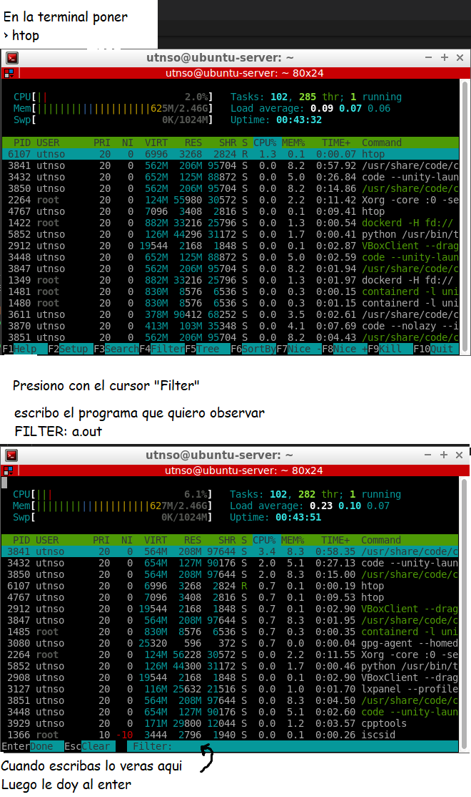
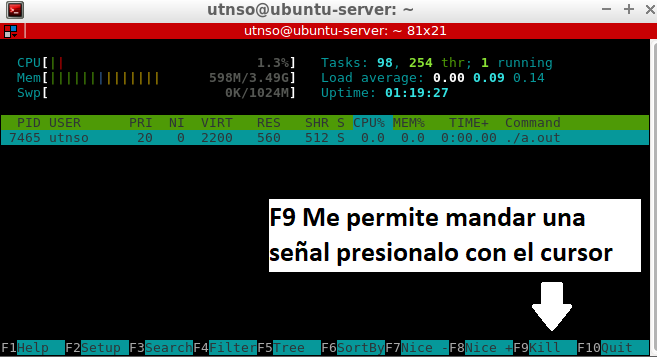
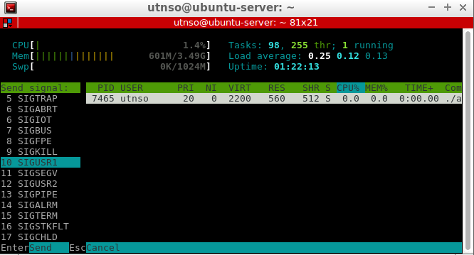

## HTOP y Señales

HTOP: Es un comando para ver todos los procesos (su PID/USER/USO de CPU/)

La ultima linea son comandos que podemos usar puedes acceder con el teclado o directamente con el mouse dánosle clic

En este caso se muestra el uso de filter con el nombre del ejecutable que queremos visualizar



Tendríamos la siguiente vista



Para **mandar señales** con `KILL`



Vemos una columna a la izquierda elegimos la señal que queremos mandar al proceso

````c
2 SIGINT  'Equivale a un Ctrl+c'
9 SIGKILL 'Equivale a un Kill PID o matar terminal'
10 SIGUSR1 'Algun tipo especifico de señal no se'    
````

