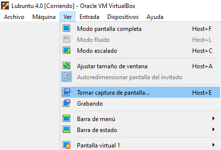
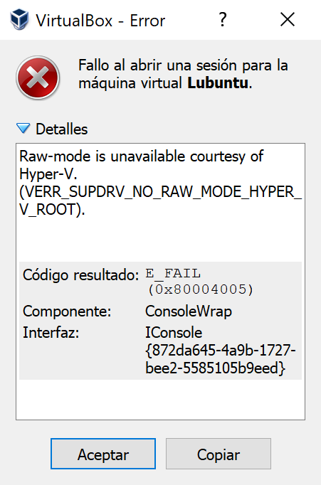
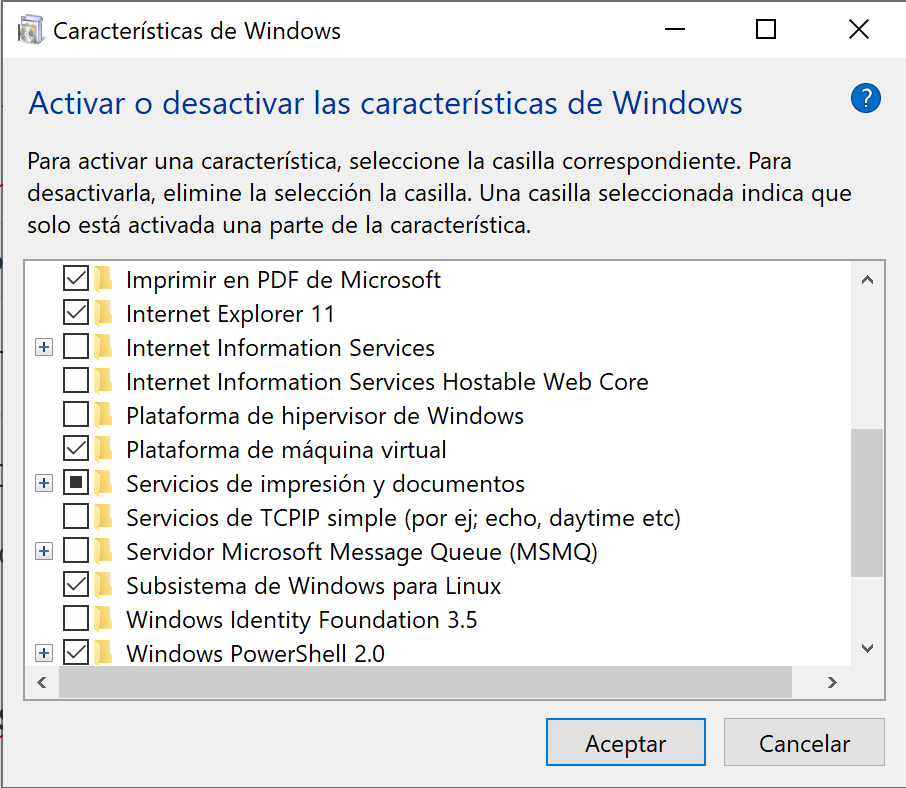
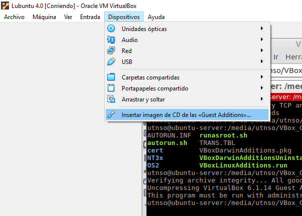

## Terminal

<span style="background:yellow;">Comandos Básicos</span>

#### Sacar la Consola

Sirve si no carga la barra de abajo:  <kbd>Ctrl</kbd> + <kbd>Alt</kbd> + <kbd>T</kbd> 

````powershell
> entrar a una ruta
cd ./carpeta

> listar el contenido de la carpeta donde estoy paradp
ls

> Subir una carpeta
cd ..

> Limpiar consola
clear

> Volver a la raiz
cd

> Ruta donde estoy
pwd
````

*Ademá*s se sabe que, el punto <kbd>.</kbd> representa la **carpeta actual**

````powershell
> cd .           | Esto no me llevara a ningun lado
````

*Me servirá para explicitar la carpeta en la que estoy*


## Compilación

````shell
gcc pepe.c -o hello
````

Esto se traduce en compilar el archivo `pepe.c` para generar un ejecutable `hello`

El resultado de esta compilación es un **código binario**

Para ejecutar el `hello` poner en consola

````shell
./hello
````


### MakeFile

NANI? Que pasa si tengo varios `.c` ,varios `.h` , **es un archivo que es una suerte de script orientado a la compilación**


### Las commons

Una biblioteca de funciones propuestas por la catedra.

https://github.com/sisoputnfrba/so-commons-library

La instalación también aparece en el tp0

https://docs.google.com/document/d/1fWasPFTUQrU-D0giMYRkbgu0hnAwjVzxCp_bCavnP8c/edit

````powershell
git clone https://github.com/sisoputnfrba/so-commons-library
cd so-commons-library
sudo make install
cd ..
````

Solo se realiza una ves y ya lo puedo usar en cualquier proyecto


## ECLIPSE

**Como importar un proyecto**. Por ejemplo uno de Git. Una ves tenemos la ubicación de la carpeta. Abrimos Eclipse `File/New/Makefile Project with Existing Code`

Luego en `Existing Code Location` seleccionamos el proyecto y todo se rellena

Elegir solo `C` y `Linux GCC` :smile:


## Sobre la maquina Virtual

Ir a la pagina y descargar el entorno virtual son 5 partes

En esa misma pagina abajo hay videos de como instalar y demás

A la hora de `iniciar `no tocar nada solito carga todo

#### Tomar Captura de Pantalla



#### Problema de Hyper en Windows



Vea la siguiente pagina, a mi me paso

https://stackoverflow.com/questions/50053255/virtualbox-raw-mode-is-unavailable-courtesy-of-hyper-v-windows-10

De ese enlace yo use estas dos alternativas y me soluciono

------

#### Es posible que deba deshabilitar el hipervisor

Entonces, sigue los siguientes pasos:

**1)** Abra el símbolo del sistema como administrador

**2)** Ejecute bcdedit para verificar el estado del hipervisor:

```
bcdedit
```

**3)** Verifique **hypervisorlaunchtype** queremos que este en `off`

**4)** Si está configurado en **automático** , desactívelo:

```
bcdedit /set hypervisorlaunchtype off
```

**5)** Reinicie tu computadora luego inicia VirtualBox nuevamente

------

**disabled Hyper-V:** Control Panel\Programs\Programs and Features\

Mas fácil → Pone en consola ejecutar →  `OptionalFeatures.exe`



Desmarcar lo que diga **Hypervisor** en mi caso que esta en español  →  `Plataforma de hipervisor de Windows`

#### Guest Additions

Esto es para mejorar la resolución de la pantalla y no se quede en solo un cuadrado

**Usar la versión de Virtual Box 5. algo** En la 6 hay que hacer muchos cambios

Yo me demore en encontrar, era igual que en **Ubuntu** :smiling_imp:



A partir de acá es solo seguir el video.
