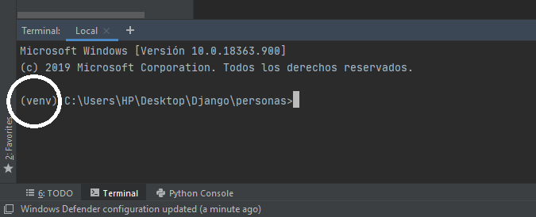
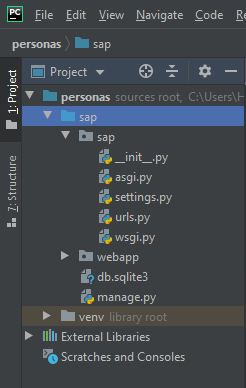
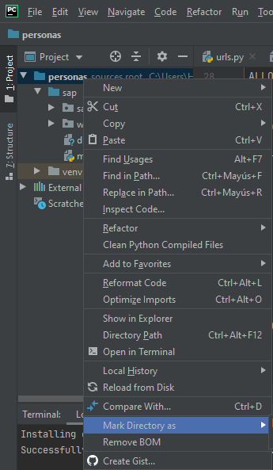

<p align="center"></p>

## Framework de Python

Principalmente para el desarrollo de paginas web

Usaremos PyCharm es un IDE como visual studio, **por que no VS code?** este esta dedicado a proyectos en python así que tomala. 

### Crear un entorno para el Proyecto

**Notar el environment (Virtualenv)** : Se crea una carpeta :open_file_folder: **venv** donde estará las dependencias, como el `package.json en javascript`. Por que hacemos esto :RPTA las dependencias se instalan en el entorno no en tu computadora aumentando la portabilidad de nuestro código


### Instalación Django

(revisar que estemos dentro del environment virtual): Desactivar antivirus, windows defender, firewall o cualquier software si falla este proceso esto instala django y sus dependencias



Con el comando

````shell
python -m pip install django
````

revisar la versión de django:

````shell
django-admin version
````

Esto que hicimos recién fue crear el entorno e instalar django en el.

### Estructura del proyecto

Crear un nuevo proyecto django: (sap / o el nombre que tu quieras)

````shell
django-admin startproject sap
````



Se creara la carpeta `sap` con la siguiente estructura: Una carpeta `sap` con lo siguiente:

- `__init__.py `  : Dejalo identifica que es python
- `urls.py` : Las rutas de nuestro proyecto
- `settings.py` : Conexión a BD y mas

Movernos a la nueva carpeta del proyecto donde está el archivo **manage.py**  `cd sap`

Ejecutar la aplicación: Luego abrir un navegador e ir a localhost u 127.0.0.1:8000

````javascript
python manage.py runserver

/*Cosa curiosa relacionada en javascript
manage.py    <=>  index.js                */
````

### Creación de Aplicaciones (App)

Estar en la carpeta del proyecto `sap` (no en la carpeta raíz) `personas`

```
python manage.py startapp webapp
```

Se puede eliminar todo excepto __init__.py y views.py de la :file_folder: **webapp**

**Modificar** settings.py a nivel del proyecto: Con esto nuestro programa principal importara `webapp` 

```python
INSTALLED_APPS = [
    'django.contrib.admin',
	# Mas lineas, poner al final
    'webapp',
]
```

Puede ocurrir un error sobre que no **encuentra este modulo** este se arregla diciéndole a PyCharm cual es la **carpeta base** de nuestro proyecto. Entonces le damos <kbd>click derecho</kbd>  a :file_folder: **sap** y en *Mark Directory as* > *Sources Root* . Con esto debería andar



En la carpeta `view.py`

```python
from django.http import HttpResponse

# Create your views here.
def buenas(request):
    return HttpResponse('Hola Perro')
```

En la carpeta `url.py`

```python
from django.contrib import admin
from django.urls import path
from webapp.views import buenas

urlpatterns = [
    path('admin/', admin.site.urls),  # Una ruta gratis
    # path('hello', buenas),  # Sin parentesis
    path('', buenas),
]
```

