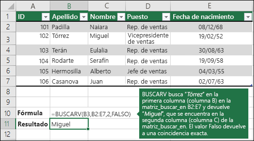
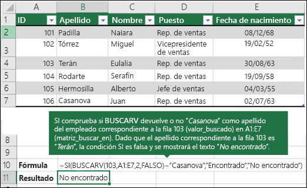
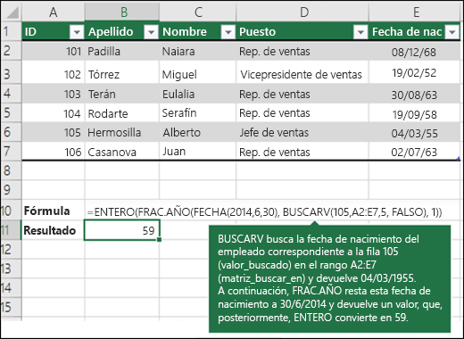

# EXCEL

Dado que recuerdo SQL mas que Excel, y como hay una relación entre ellos. Para buscar,Filtrar por condición, SUM, AVG


### BUSCARV

**Buscar V** (*Valor*), busca un valor en una tabla



Recordar que :

````visual basic
BUSCARV("Torrez", ..)
			|->	Si  pones el cuadro, tomara su contenido
BUSCARV(B3,B2:E7, ..)
			|->	La Tabla
BUSCARV(B3,  B2:E7, 2 , ..)
					|->	La columna del return de la Tabla anterior
````

<span style="background:yellow;">Si hay mas de un resultado en la búsqueda devuelve el primero</span>


### SI

Como el IF de programación :



````javascript
La comparacion es con '=' no con '=='
````


### FECHAS




### BUSCARX o XLOOKUP


````javascript
Algo que no se menciono es que el primer valor cuando es un cuadro, a medida que cambio el valor de ese cuadro se cambia el resultado

Ademas, la diferencia con BUSCARV es que puedo devolver mas de un dato de la fila encontrada.

En este caso devolvi "Nombre de empleado" y "Departamento"
````

