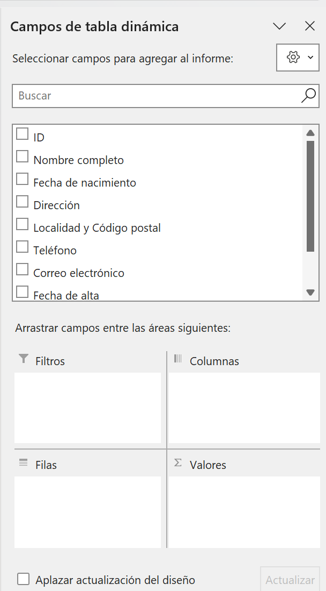
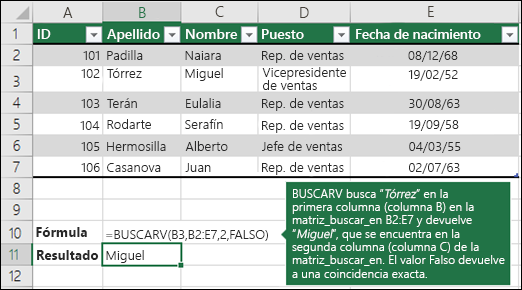
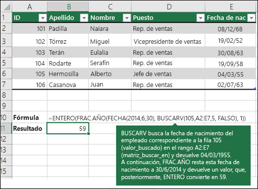

# EXCEL

Dado que recuerdo SQL mas que Excel, y como hay una relación entre ellos. 


## TIPS

- Para fijar una celda en Excel, se puede utilizar la ``tecla [F4]``. Esta tecla permite cambiar entre los **tipos de referencia**, como las ***relativas***, ***absolutas*** y ***mixtas***  (el simbolito $)
- Para que todas las columnas se ajusten al ancho del contenido:
	1. Selecciona todo la hoja
	2. Parate en la cabezera y entre cualquier par de divicion de columnas, ej entre B y C y doble click
- Con la ``tecla [Alt]`` te permite ver las teclas de atajo rapido (son esos **cuadritos negros**), para salir vuelve a usar la  ``tecla [Alt]``
- ``Ctrl + Shift + abajo ``: para seleccionar desde una celda hasta la ultima celda que tenga contenido


### Tabla

Ya tengo datos, pero si quiero ordenar o filtrar? Necesito tener una tabla propiamente dicha en excel. Que es lo mismo pero ahora la primera fila se convierte en la cabecera, donde cada cabecera tendra un pequeño botom para filtrar y demas opciones.

Bueno eso se logra realizando lo siguientes pasos:

1. Seleccione una celda con datos.(cualquiera con data)
2. Seleccione ``Inicio`` > Dar formato como tabla.
3. Elija un estilo para la tabla.(osea el colorcito)
4. En el cuadro de diálogo ``Crear tabla``, establezca el rango de celdas.(casi siempre lo intuye bien)
5. Marque la opción La tabla tiene encabezados si procede.

Ya con una tabla propiamente dicha, si seleccionas cualquiera de sus celda, aparecera una seccion **Diseño de la Tabla** dondre podremos editar el formato y diseño de la tabla.


### Tablas Dinamicas

1. Elegir cualquier celda dentro de la tabla
2. **Insertar** > Tabla Dinamica
3. Se salta un cuadro con las opciones
	- Seleccionar una tabla o rango: Aqui vemos que lo infirio, pero tambien se puede seleccionar
	- Elija donde se va a colocar la tabla dinamica:
		- Nueva hoja de calculo
		- Hoja de calculo existente: Te pedira que selecciones algun cuadro

Tenemos a la derecha: **Campos de tabla dinamica**

<div style="display: flex; gap: 20px;">
  <div style="flex: 1;">
    <h3>Campos de tabla dinamica</h3>
    
  </div>
  <div style="flex: 1;">
    <h3>Secciones</h3>
	<h4>Campos</h4>
    <p>Lista de todas los campos, estos se pueden arrastrar en la siguiente seccion</p>
	<h4>Columnas</h4>
	<p>Me sirve mirarlo como un equivalente a realizar GROUP BY en SQL</p>
		<li><b>Filtro:</b> Te aparece arriba un drowpout para filtrar</li>
		<li><b>Columnas:</b> Abre los valores de este campo a nivel <b>Columnas</b>, tambien hay jerarquias.
		<li><b>Filas:</b> Abre los valores de este campo a nivel <b>Fila</b>
		<li><b>Valores:</b> Por defecto el campo arrastrado es la suma en funcion de lo que haya en Columnas y Filas , se puede modiciar</li>
  </div>
</div>


## INDICE
<!-- TOC -->
- [Exportar](#exportar)
- [Funciones](#funciones)
    - [BUSCARV](#buscarv)
    - [BUSCARX o XLOOKUP](#buscarx-o-xlookup)
	- [SI](#si)

<!-- /TOC -->


## Exportar

Para exportar tu Excel a un PDF, a veces sale cortado. Seguir los pasos
1. Ir a la seccion ``Vista``
2. ``Ver salto de Pagina``
3. Arrastrar la delimitacion entre la Pag1 y Pag2
4. `Ver Normal`
5. Exportar -> Pdf


Otra opcion puede ser:
1. Imprimir
2. Orientacion Vertical o Horizontal
3. Jugar con el Ajuste, para que entre todo en una sola pagina


## Funciones

Para buscar,filtrar por condición, SUM, AVG


### BUSCARV

Busca un valor en una tabla

```shell
BUSCARV(valor_buscado; matriz_tabla; indicador_columnas; [rango])
```



Recordar que :

````visual basic
BUSCARV("Torrez", ..)
			|->	Si  pones el cuadro, tomara su contenido
BUSCARV(B3,B2:E7, ..)
			|->	La Tabla
BUSCARV(B3,  B2:E7, 2 , ..)
					|->	La columna del return de la Tabla
````

Si hay mas de un resultado en la búsqueda devuelve el primero


### BUSCARX o XLOOKUP

Algo que no se menciono es que el primer valor cuando es un cuadro, a medida que cambio el valor de ese cuadro se cambia el resultado

Ademas, la diferencia con **BUSCARV** es que puedo devolver mas de un dato de la fila encontrada.

En este caso devolvi "Nombre de empleado" y "Departamento"


### SI

Como el IF de programación : La comparacion es con `'='` no con `'=='`


### FECHAS

