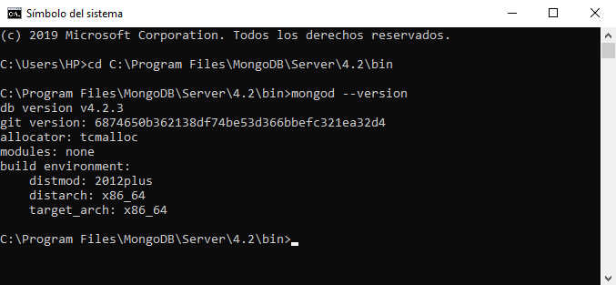
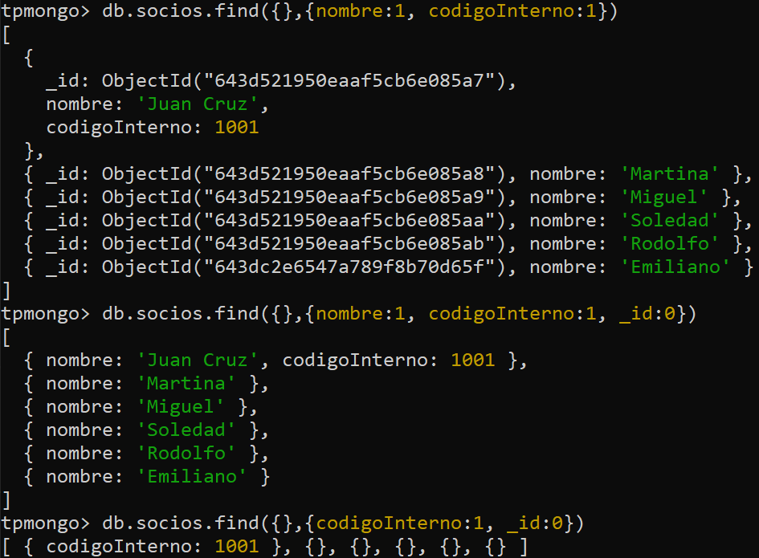
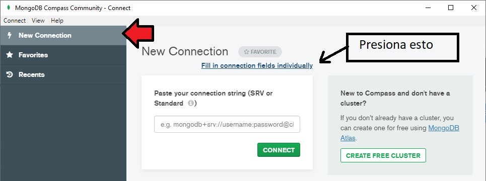
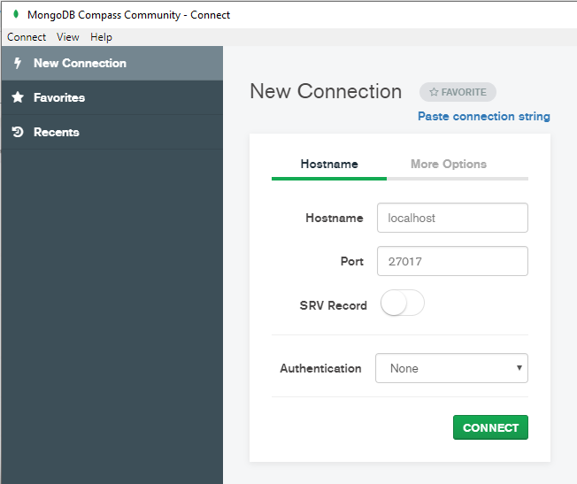

# Introducción a Mongo DB 

Es una base **NOSQL** que fue diseñada para el almacenamiento de grandes volúmenes de datos, esta escrita en C++ y es multiplataforma.

Esta orientada a *documentos* (se refiere a los datos qua vamos a estar guardando)

De echo guardaremos objetos de JavaScript llamados *documentos*. Se guardan en formato de JSON 

## Instalación

Buscar`mongodb community server` en  <kbd>Google</kbd>  , seleccionar:

- **OS**: Windows x64 x64
- **Version**: 4.2.3 ( current version)
- **Package**: MSI

Se descargara un *ejecutable mongodb-win32-x86_64-2012plus-4.2.3-signed* darle siguiente a todo.

> Cuidado:  Quitar la palomita de dejarlo como servicio, así solo se ejecutara cuando lo necesites y no en todo momento

Luego de instalado entro por consola `cmd`  a la ruta `C:\Program Files\MongoDB\Server\4.2\bin` y escribo `mongod --version`



Pero estaría bueno tener este comando desde cualquier lugar de la consola y no estar buscando la ruta a cada rato, para esto hay que agregarlo al `path` así lo tenemos disponible en cualquier lugar de la `cmd`

Ir a la ruta ***Panel de control\Sistema y seguridad\Sistema*** :arrow_right: <kbd>Configuracion avanzado del sistema</kbd> :arrow_right: <kbd>variables de entorno </kbd> :arrow_right: Doble clic en <kbd>Path</kbd> :arrow_right: <kbd>Nuevo</kbd> pegar la ruta , Aceptar y Cerrar 

Ahora podemos hacerlo desde cualquier lugar en la consola.

## Ultimas Configuraciones

En **C:\\** crear :card_index_dividers: llamada **data**, dentro crear :card_index_dividers: llamada **db** . Ahora al ejecutar `mongod` en la consola, **se mantiene ejecutando**, no a acaba que es lo que queremos , dado que va estar esperando peticiones de consulta a la BD, cuando ya no queramos usarla  <kbd>Ctrl</kbd> + <kbd>C</kbd> y cierra esta ventana.

> Útil:  En los logs me da informacion importante como  **port 27017**


## Paradigma

| SQL             | No SQL                                          |
| --------------- | ----------------------------------------------- |
| Tabla           | <span style='color:green'>**Collection**</span> |
| Fila o Registro | <span style='color:green'>**Document**</span>   |

<span style='color:green'>**Collection**</span> , que seria un array de objetos en JavaScript llamados <span style='color:green'>**Document**</span> .


## Primeros pasos

Necesitamos dos consolas:

1. *mongod* : Esta terminal se quedara corriendo ( no la cierres ), espera peticiones ("seria nuestro servidor de base de datos")
2. *mongo o mongosh* : Esta terminal es nuestra <span style='color:red'>**Instancia**</span>. Aquí podemos mandar sentencias (create database, etc).

>Tip : en la consola de mongo, podemos limpiar la pantalla con el comando **cls**

La consola de *mongo* es un interprete de JavaScript , que se utiliza para operar con la base de datos.

> Tip: Podemos usar otra <span style='color:red'>**Instancia**</span> (cmd) que sea (GUI) llamada <span style='color:green'>**MongoDB Compass**</span>. 


### Conceptos

En la consola de *mongo* podemos usar bibliotecas de JavaScript como por ejemplo:

````javascript
> Math.sin(Math.PI / 2)
1
````

Además `new Data()`, también podemos definir nuestras funciones para luego ser usadas.

#### Muestra la base de datos actual.

````javascript
> db
test  //Por defecto cuando nos conectamos en mongo, nos conecta a 'test'
````

#### Que base de datos existen

````javascript
> show dbs
admin 	0.000GB
config 	0.000GB
local 	0.000GB
````

> Te olvidaste de los comandos:    > db.help()    te da una descripción


#### Levantar Mongo mas especificamente
Por default guarda en una ruta data/bd
Debe existir esa ruta si no da error. 
````javascript
> mongod --port 27627 --dbpath C:\mdb\Prueba2 --logpath c:\mdb\mongo\Pru2.log
````
Tambien podemos poner la ruta que queramos:  `--dbpath`

Si no pongo  los logs lo mandan a pantalla: `--logpath`


#### Crear o pararme en una Base de datos
````javascript
> use nombreDatabase
````

> TIP : Mongo no crea una base si no le insertas al menos un documento en alguna collection

#### Borrar una Base de Datos

````javascript
> db 
webstore  // primero estar parado en la base que quiero borrar
> db.dropDatabase()
{ "dropped" : "webstore", "ok" : 1 }
````


### <u>Collection</u>

> Para todas las operaciones de Collections, <span style='color:red'>**recuerda en cual base estas parado**</span> 

#### Crear una collections

````javascript
> db.createCollection("products")
{  "ok" : 1 }
````

#### Ver Collections

````javascript
> show collections
````

#### Insertar datos

Insertamos objetos de JavaScript .No te olvides cerrar el paréntesis . 

````javascript
> db.products.insert({ "name" : "laptod"}) 
// Si la collection no existe, 'mongodb' la crea automaticamente
// Cada dato que guardemos, 'mongodb' le asigna in "_id" unico por defecto

//Insercion de multiples elementos
> db.products.insert([
    {
      "name" : "mouse",
      "unidades" : 23	
    },
    {
      "name" : "compu",
      "unidades" : 2	
    }
]) 
````

#### Remover una collections

````javascript
> db.products.drop()
true
````

#### Ver los datos (Documents) de la collections

````javascript
> db.products.find().pretty() // muestra los elementos de la collection
// El pretty mejora la vista en la terminal
````

Como *mongo* guarda los datos?, bueno transforma el formato `json` a `bson` un formato binario que le permite mejorar el manejo de gran cantidad de datos,

Una característica de *mongo* es que sus datos no tienen que tener la misma estructura a diferencia de SQL

### Funciones
Forma General:   `db.products.find({WHERE},{SELECT})`  . El find es buscar
````javascript
// Los productos que tengan en la propiedad "name" el valor "mouse"
> db.products.find({name: "mouse"})
````

### ARRAY - LISTA
````javascript
// Consultar una matriz para un elemento
// "mouse" puede estar en un array y te lo busca si esta ejemplo: {'name' : ["mouse","logited"]}
// Devuelve los documentos que tienen "mouse" como elemento de la lista 'name'
> db.products.find({name: "mouse"})


// Coincidir con una matriz
// El siguiente ejemplo consulta todos los documentos donde el tags valor del campo es una matriz con exactamente dos elementos, "red"y "blank", en el orden especificado:
db.inventory.find( { tags: ["red", "blank"] } )

// Si, en cambio, desea encontrar una matriz que contenga tanto los elementos "red"como "blank", sin tener en cuenta el orden u otros elementos de la matriz, utilice el $alloperador
db.inventory.find( { tags: { $all: ["red", "blank"] } } )

// Agregar un elemento a un array
db.inventory.update({},{ $push: { deportes: 'GOLF' } })

// Agregar elementos a un array
db.inventory.update({},{ $push: { deportes: {$each: ['GOLF','TENNIS']}}})

// Eliminar elementos de un array
db.inventory.update({},{ $pull: { deportes: 'RUGBY'}})
````

````javascript
// hicimos un Salto pór los arrays ahora continuamos

// La coma, es un AND para concatenar mas condiciones
> db.products.find({name: "mouse", cant:23 })

// El 'primero documento' que cumpla las restricciones
> db.products.findOne({name: "mouse", cant:23 })

// SELECT en mongo
/* db.products.findOne({restricciones},{los campos})
Para esto ultimo ponlos de la siguiente forma
"atributo" : 1  /si quieres verlo
"atributo" : 0  /si no quieres verlo  

*) Si no especificas el 0 para el '_id' siempre te lo retornara
**) Aunque existan documentos sin los campos 'name' o 'descripcion' si cumplen la condicion estaran, porque recordemos eso es un SELECT y ya paso por el WHERE.
Incluso de no contener ningun campo del select(quedaria el _id), pero incluso si ponemos '_id':0 seguiran apareciendo como documento vacio {} */
> db.products.find({name: "mouse", cant:23 },{"name": 1,"descripcion" : 1})
````


````javascript
// ORDER BY
// sort({atributo : 1}) ordena por atributo en forma ASC y -1 en forma DESC
> db.products.findOne({name: "mouse"}).sort({name :1})

// LIMIT
> db.products.find().limit(2)

// COUNT
> db.products.count()

// LIKE : Usa expresiones Regulares
db.users.insert({name: 'paulo'})
db.users.insert({name: 'patric'})
db.users.insert({name: 'pedro'})

db.users.find({name: /a/})  //like '%a%'
respuesta: paulo, patric

db.users.find({name: /^pa/}) //like 'pa%' 
respuesta: paulo, patric

db.users.find({name: /ro$/}) //like '%ro'
respuesta: pedro


// Me traigo una imagen
docum=db.ordenes.findOne() 
// Se puede modificar en memoria pero no en disco
docum._id=1111
// Hasta que lo inserte
docum.Write()
````


### Actualización de registros

````javascript
>   db.collection.update(query, update, options)
/*  El 'update' original solo modifica uno, el primero que cumpla la query/condicion. 
    Para tomar todos los que coincidan se usa el flag: en 'options' ->  {multi:true} 
    En las ultimas actualizaciones de mongo añadieron los updates especificos: 'updateOne' y 'updateMany'
*/

// OJASO: REEMPLAZA TODO EL DOCUMENTO ,TODO no solo el price
> db.products.update({"name": "mouse"},{"price": 99 })
// Actualmente esta deprecandose a partir de cierta version de mongo y no te salta error, te pide explicitamente que pongas el $set


// Como hago para no cambiar todo el document, esto solo cambia el valor del campo "descripcion"
> db.products.update({"name": "mouse"},{$set: {"descripcion" : "un gran equipo"}})  
// Si no encuentra el campo "descripcion" lo crea en todos los documentos que cumplieron esa condicion
// Si ya existe, solo modifica, los que cumplen la condicion	


//Incrementar un valor numerico
> db.products.update({"name": "mouse"},{$inc : {"price" : 0.01}})

//Renombrar el nombre de un campo
> db.products.update({"name": "mouse"},{$rename : {"price" : "nombre"}})
                     
````


### Borrar de registros

````javascript
//Borra los documentos que cumplan la condicion
> db.products.remove({"name": "mouse"})

//Borrar todos los documentos no collection
> db.products.remove({})
````


### Signos y cursada de desarrollo web avanzado

````php
db.coleccion.find({condicion})
Operadores mysql ( = , <>, >, <)
Operadores mongo ($eq, $not, $gt, $lt, $gte, $lte)
$eq : Igual
$not : Distinto // Tambien funciona como negacion
$gt : Mayor a
$lt : Menor a 
$gte : Mayor o igual a
$lte : Menor o igual a
    
$exists : Boolenao (true o false)  //true => propiedad necesariamente debe existir
$size: 23  // Tamaño de la propiedad
$in: in (dentro de(un array)
$nin: not in (no dentro de (un array))

    
//Ejemplos    
db.coleccion.find(
	{
		nombre : { $eq : 'cadena' }	   //Los que cumplan esta condicion
	}
)
         
// Entonces, ¿para qué usar $and si ya lo hace implícitamente? Pues porque en ocasiones, lo utilizaremos para concatenar operadores $and y operadores $or.
         
db.coleccion.find(
	{
		$or : [			//Los que cumplan alguna de estas condiciones
			{stock : {$eq : 50}},
			{precio : {$gte : 30}}
		]
	}
)


// Me traen todos los documentos que no tienen el campo 'estatus' y los que lo tienen con valor distinto a 'A'
db.coleccion.find({estatus : {$not : 'A'}})
````

### Cursores

Un cursor es una conexión con el servidor que permanece abierta, y que permite iterar sobre los resultados de una consulta, de forma que estos se devuelvan poco a poco. Por defecto un cursor en la shell (si no se asigna a una variable), devuelve 20 elementos. Si nuestra intención fuera recorrer todos los resultados que nos devuelve un cursor, podríamos usar un script parecido a este:
````javascript
var miCursor = db.genbetadev.find();
    
while (miCursor.hasNext()){
  socio = miCursor.next();
  print("Nro: "+socio.nro_socio+" Ape. y Nom: "+socio.apellido+" "+socio.nombre);
};  
````


## Funciones con JavaScript

### forEach

````javascript
> db.products.find().forEach(pro => print("El producto: " + pro.name))
````


## Compass GUI de Mongodb

Venimos usando la consola `cmd` *mongo* ahora usaremos compas una GUI para usarla debemos seguir los siguientes pasos

1. Dejar corriendo en el `cmd` mongod.
2. Abrir Compas e ingresar *Fill in connection ...*



Darle a **connect**



> Si hay algún error dale enter a *mongod*, para aceptar la conexión, cuando lo hice no fue necesario

Existe otros GUI para mongo como : `robomongo` robo 3t, `mongo buster` 