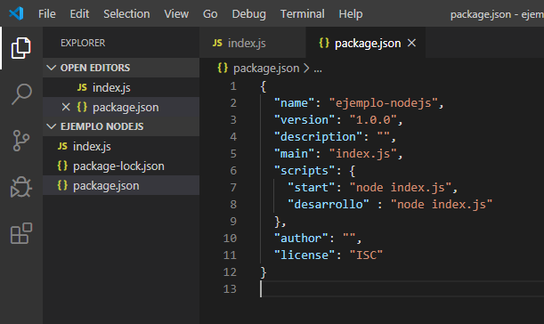

- NodeJS es un entorno de ejecución de JavaScript . Compila código JavaScript
- Tu maquina no reconoce el lenguaje JavaScript solo ejecuta programas
- Resolvió la problemática de las conexiones concurrentes, antes (con JAVA, PHP,.. ) si se conectaban 10000 usuarios a tu pagina era mucho. Se creaba un hilo por cada conexión de usuario y se caía la pagina.
- Crear conexiones de manera asíncrona


##### Instalación 

Mira un video de YouTube

````javascript
> node --version       // Puedes comprobar si lo tienes, en la consola
````


##### Ejecutar un script 

````javascript
> node miejemplo.js
````


Las buenas practicas dicen tener un `archivo principal`  (el que se ejecuta) y las demás funciones se importan a este archivo

````javascript
Tengo un archivo `mate.js` | que tiene funciones y propiedades
function sumar(a ,b){return a + b ;}
// Para exportar las funciones de este archivo
// export.(un nombre que yo quiera) = "el nombre de la funcion definida"
exports.add = sumar;

// por lo general se escriben igual para no perder la simplicidad
exports.restar = restar;    // si nesecita mas funciones

// Podemos exportar todo el modulo ó (objeto, funciones,etc)
module.exports = nombreDelModulo  // Yo uso esto con [func1,func2,..] una linea.


--------------------------------------------------    
En el archivo `index.js` // el (./) me dice que estoy parado en la ubicacion del archivo index.js

// Para importar las funciones del archivo mate.js
const math = require('./mate.js');

// Es como si 'math' fuera un objeto y las funciones sus metodos
console.log(math.add(1,2))
````


##### NodeJS ya viene con módulos instalados, como los llamamos?

````javascript
// Podemos leer la documentacion de nodeJS en |DOCS|v10.6.0 API Ejemplos
const os = require('os')  // Tiene informacion del S.O.
consol.log(os.cpus()) // Informacion de mis CPUs
fdsgole.log(os.release()) // Info del S.O.
````

````javascript
// Escribir un arhcivo
//fs.writeFile("ruta y nombre del archivo",CONTENIDO, CALLBACK)
fs.writeFile('./newtexto.txt',"linea uno",function(err){
    if(err){ console.log(err)}
    console.log("Archivo creado")
})
// importante: se ejecuta el CALLBACK cuando se termino lo anterior, que como es trabajo del SO lo delega y sigue ejecutando las demas filas.


// Leer un archivo
fs.readFile('./texto.txt',function(err, data){
    if(err){ console.log(err)}
    console.log(data); // pero esta en un formato raro
    console.log(data.toString()); // Apa la papa
})

// Eliminar un archivo
fs.unlink('data.txt',(err)=>{});


//NO OLVIDES QUE TODO ESTA EN LA DOCUMENTACION y tener en cuenta que estos metodos son asincronos si quiero que sean sincronos existen funciones similares para esto por ejemplo
let data = fs.readFileSync('data.txt','utf-8')
````


##### El Asincronismo, para tareas que nodeJS no hace

````javascript
// En este caso 'consulatar la base de datos' no lo hace nodeJS 
query('SELECT * FROM users', function(err,users){
    if(err){
        console.log(err)
    }
    if(users){
        // Hacer algo con ellos
    }
})
````


###### La tarea principal nodeJS es crear servidores, :smiley: SI, hay un modulo para eso

````javascript
const http = require('http')

http.createServer(function(req,res){  // creando un servidor
   res.writeHead(200,{})  // Informacion de la cabecera
   res.write('<h1>Hola mundo desde NodeJS</h1>') 
   res.end()
}).listen(3000);  // en que puerto escucha

//Para verlo ir a localhost:3000
````

````javascript
http.createServer(function(req,res){
   // Informacion de la cabecera
   res.writeHead(200,{ 'Conten-type': 'text/html'});  
   res.write('<h1>Hola mundo desde NodeJS</h1>') 
   res.end()
}).listen(3000);

//Para verlo, ir a 'Network' y recargar la pagina
````


###### Existe un modulo que me sirve y se usa mucho para proyectos en nodeJS (npm)

````javascript
// Podemos usar modulos de otras personas con 'npm' , la documentacion esta en la pagina de npm, ejemplo este es para colorear.
$ npm install color

// Que sucede? 
// Se crea una carpeta [node_modules] : Se encuentran los modulos instalados
// Un archivo [package-lock.json] : Una lista de todos los modulos instalados y y algunas especificaciones de estos. 

// Estas dos cosas no se tocan OJoncio, en nuestro index.js
var colors = require('colors'); // por que existe en nuestro proyecto
console.log('hello'.green); // outputs green text
//Apa la papa en verdecito en la cmd
````


Obviamente se usan muchos módulos y se debe poder usar por cualquiera en cualquier maquina, entonces necesitamos una lista de dependencias

````javascript
// Esto crea un archivo json (package.json) con informacion del proyecto y las dependencias
> npm init
Enter a lo que quieras por defecto si no modificar a tu gusto
Fijate en las dependencias
````

#### BUG 2020

Me salía un error al ejecutar el `npm init` me pedía el nombre del proyecto, no es problema pero hay una <span style="background:yellow;">solución mas rápida</span> ,es ejecutando `npm init --yes` es igual al anterior pero le da todos los valores por defecto inclusive el nombre del proyecto y automáticamente se crea el `package.json`


Me olvidaba no subes `node-modules `pesa mucho , con `package.json` tenemos la lista de dependencias y se descarga en cada computador

Como recuperamos la carpeta  `node-modules` a partir del  `package.json` fácil con el comando `npm install`, lo que hace es leer el `package.json` e instalar las dependencias que aparecen acá.



Vemos en la imagen (package.json ) que   "scripts" :{ "start" : "node index.js"} esto es muy importante si en la consola escribo `npm start` se ejecuta `node index.js`  que es la forma que usábamos para ejecutar un archivo en JavaScript

También podemos tener nuestro propios comandos como `npm desarrollo` que ejecuta `node index.js` 

> Observación: cuando no es "start" se debe poner `npm run desarrollo`


#### Express

Nosotros no necesitamos escribirlo todo desde cero, existe **framework** como **Express**

````javascript
> npm i express --save   
//El modificador (--save) agrega la dependencia en el package.json
//En las ultimas versiones no es nesesario, ya q lo hace automaticamente

//Como venimos haciendo
const express = require('express');
//El color no olvidar XD
const server = express(); // se crea un servidor
server.get('/', function (req,res)=>{
	res.send('<h1>Hola Express y Node</h1>')
	res.end();
});

server.listen(3000, function () => {
    console.log('Server on port 3000'.red);
});
````

### Apéndice

Presentamos unos módulos que pueden ser te útiles.

#### Lodash

Para trabajar con JSON

````javascript
const _ = require('lodash');

let x = { "nombre" : "Juan"}
let y = { "apodo" : "Mitocode"}
let z = [
	{ nombre : "Jaime",apellido: "Medina", edad: 26},
	{ nombre : "Mito", apellido: "Code" , edad: 26}
]

//Crea un JSON juntando las dos variables, sin este modulo habria que usar funciones(.parse() ó .stringify()) y concatenar.
let resultado = _.assign(x,y);
console.log(resultado)

//Repetir cosas sin for o while [Chekaesta]
_.times(3, () => console.log('Suscribete'))

//Buscar en un JSON
let resultado = _.find(z,{nombre :"Jaime"})
let resultado = _.find(z,{nombre :"Jaime", apellido :"Mendez"})
console.log(resultado)
````

#### Yargs

Te ayuda a crear herramientas interactivas de línea de comandos, analizando argumentos y generando una elegante interfaz de usuario.

Primero recordemos como en C# o en otro lenguaje puedo pasar argumentos antes de iniciar la aplicación. Generalmente es en la `función main(argv[])` donde el `argv[]` es la lista de argumentos. Para resumir en C# si ejecutábamos esto.

````shell
$ miPrograma.exe Juan 25
````

En el código teníamos lo siguiente

````c#
public static main(argv[]){
	// Aca entonces
    // argv[0] == "Juan"
    // argv[1] == 25    
}
````

Bueno en NodeJS podemos hacer algo parecido, solamente que es opcional no obligatorio

````javascript
let comando = process.argv[2];
console.log(comando);
````

Ejecutamos en consola

````shell
$ node miPrograma.js Juan 25
````

En el código JavaScript

````javascript
// process.argv[0] y process.argv[1] ya estan usados por defecto
// process.argv[2] == "Juan"
// process.argv[3] == 25

/Esto no lo sabia, en la consola puedes mandar variables con informacion, con el siguiente formato en consola/
$ node miPrograma.js --usuario=Mitocode
//La consola no sabe como interpretarlo


//Por eso viene la libreria Yargs, instalarla npm
const argv = require('yargs');
console.log(argv)//Tiene muchos atributos, el que me interesa es el ultimo 'argv', entonces mejoramos esta notacion

const argv = require('yargs').argv
console.log(argv)
if(argv.usuario === 'Mitocode'){
    console.log("mandaste clave valor 'usuario' = 'Mitocode' ")
}
````

### Debugear en NodeJS

Primero comprobar que nodeJs tenga una versión > 8.0 . En la consola `node inspect app.js`

Te la debo