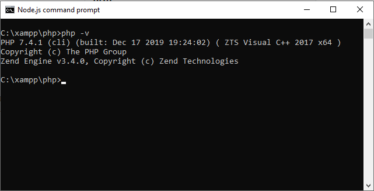
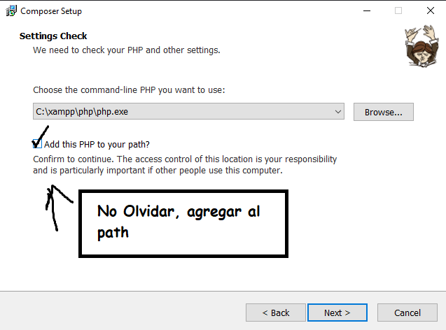
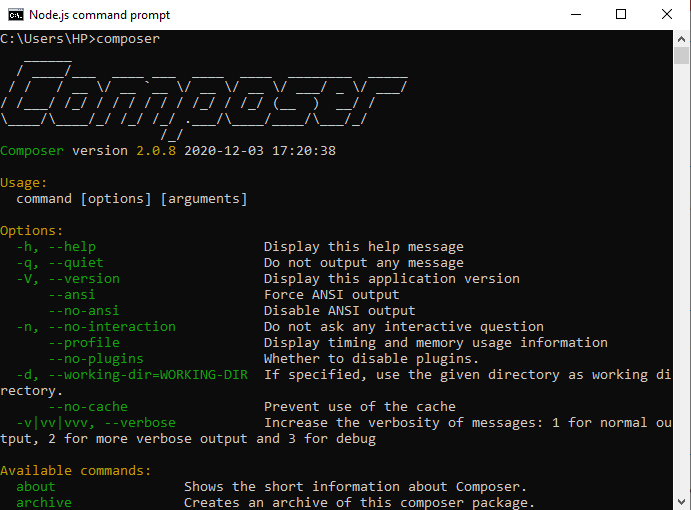

<h1 align="center">PHP</h1>

Lo primero de todo es instalar XAMPP que contiene PHP y mas

### Rutas mas Usadas

Haciendo una analogía entre PHP y JavaScript es la siguiente

| JavaScript | PHP      |
| ---------- | -------- |
| Npm        | Composer |
| Express    | Laravel  |
| NodeJS     | XAMPP    |

Primero veamos si tenemos instalado PHP y que versión. Seguramente si ya vienes trabajando con este lenguaje usas XAMPP ,efectivamente es como el NodeJS

Bueno PHP esta ubicado en:

> Para tenerlo en cualquier lugar del sistema, hay que agregar al PATH la variable de entorno

Ya con esto y con lo que sabes de XAMPP puedes ejecutar cualquier código de PHP

### Composer

Entonces lo primero es instalar `Composer` una ves instalado en nuestro sistema

Si todo va bien en cualquier lugar de la consola deberíamos poder

Vemos el Logo enorme con la versión y algunos comandos como `composer -V` que vendría Aser lo mismo pero hay mas `commands`

Listo ya tenemos tanto **XAMPP** con PHP y el gestor de dependencias **Composer**

