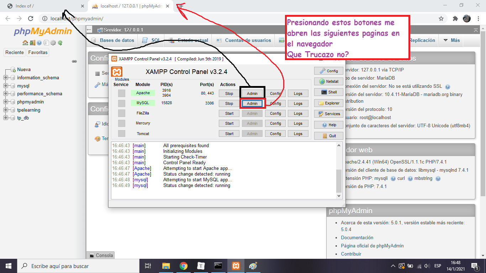
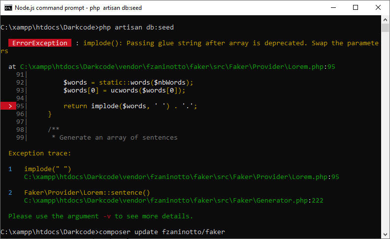

<h1 align="center">PHP</h1>

Lo primero de todo es instalar XAMPP que contiene PHP y mas

### Rutas mas Usadas

- RUTA: http://localhost/phpmyadmin/




<hr>

Haciendo una analogía entre PHP y JavaScript es la siguiente

| JavaScript | PHP      |
| ---------- | -------- |
| Npm        | Composer |
| Express    | Laravel  |
| NodeJS     | XAMPP    |

Primero veamos si tenemos instalado PHP y que versión. Seguramente si ya vienes trabajando con este lenguaje usas <span style="background:yellow;">XAMPP</span> ,efectivamente es como el NodeJS

Bueno PHP esta ubicado en:


> Para tenerlo en cualquier lugar del sistema, hay que agregar al PATH la variable de entorno

Ya con esto y con lo que sabes de XAMPP puedes ejecutar cualquier código de PHP


### Composer

Entonces lo primero es instalar `Composer` una ves instalado en nuestro sistema


Si todo va bien en cualquier lugar de la consola deberíamos poder


Vemos el Logo enorme con la versión y algunos comandos como `composer -V` que vendría Aser lo mismo pero hay mas `commands`

Listo ya tenemos tanto **XAMPP** con PHP y el gestor de dependencias **Composer**


<h2 align="center">LARAVEL</h2>

Para instalar las dependencias del proyecto

````
composer install
````

Para saber la **versión de LARAVEL**

````
php artisan --version
````

Como el código era antiguo me boto este error, como lo solucione :smile:? Siempre hay problemas con las versiones la solución es actualizar todas las herramientas, en este caso actualizar **Laravel**

````
composer update laravel/framework
````


Esto actualizo y arreglo el problema permitiéndome ver la versión de Laravel, además la podemos ver en `composer.json` 

````json
"require": {
        "php": "^7.1.3",
        "fideloper/proxy": "^4.0",
        "laravel/framework": "5.8.*",
        "laravel/tinker": "^1.0"
},
````

Para ejecutar el servidor

````
php artisan serve
````


### Seed

Cuando quise corren el seed me salió el siguiente error, según `stack overflow` se soluciona actualizando en `FAKER`



Con el comando

````shell
composer update fzaninotto/faker
````

Luego volví a correr, todo **OK**

````
php artisan db:seed
````

#### [ACTUALIZACION]

Según internet y la consola se dejara de usar `fzaninotto/faker` y se pasara a usar 

https://github.com/fakerphp/faker

Así que ojo