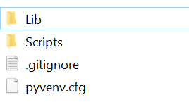
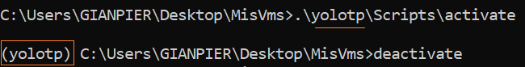
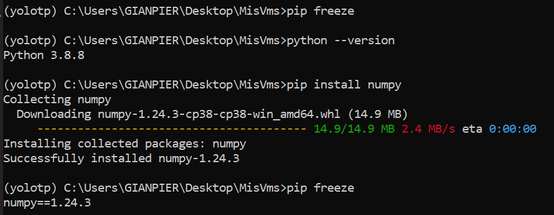

## Entornos Virtuales

### ANACONDA

Si necesitas desplegar con alguna version de python especifica algun entorno te sugiero usar conda

El entorno virtual se crea en la ruta donde esta anaconda

> Mi Compu: En mi caso uso el entorno (base) de conda como mi python local, entonces cualquier pip install que haga se guardara en como dependencia de la env (base)


Aqui estan todos los comandos

https://www.campusmvp.es/recursos/post/como-gestionar-diferentes-entornos-para-python-con-conda.aspx


1. SI quieres usar python pero tambien spyder
Lo que debes hacer es instalar conda que incluye pyhton
Asi que no instales pyhton (de lo contrario tendras 2 versiones, que pueden llegar a generarte conflicto)

******
EL proceso de instalacion
Lo mas importante es que lo instales para todos los usuarios/
que sea en la carpeta C no en la C:/Users/Name_user
Basicamente es mas facil que tus cosas esten directamente en C:
Y te ayuda un poco con el path
******

Una vez instalado el anaconda
Ahora tenemos python tambien pero si quiero tenerlo en el PATH

2. Tratar de poner en el orden de las variables de entorno lo mas arriba posible, si no algo rompe
- C:\Users\GIANPIER\anaconda3
- C:\Users\GIANPIER\anaconda3\Scripts
- C:\Users\GIANPIER\anaconda3\Library\bin

> [UPDATE: 09/12/2021 | La ruta ya no existe]  C:\Users\GIANPIER\anaconda3\Library\usr\bin


### PYTHON

Para trabajar con entornos virtuales debemos descargar la siguiente dependencia
````
pip install virtualenv
````

Veras todas las dependencias que instalaste en tu compu
````
pip freeze
````


##### Crear el entorno virtual

OJO: Este entorno tendra la misma version de python que tiene la compu(osea la base)

En una carpeta vacia, le doy un nombre al entorno ej:  `mi_vm` , esto me crea el entorno
````
virtualenv mi_vm
````

Se creara la carpeta `mi_vm` con los siguientes archivos




##### Activar el entorno virtuale

En la misma ruta donde esta la carpeta `mi_vm` (no dentro de esta) tipear
````
.\mi_vm\Scripts\activate
````

Ej de un entorno llamada `yolotp`




Ahora estas por el cmd en un entorno nuevo, juega con la consola para verificar que no siges en tu computadora :)



##### Apagar el entorno virtual

````
deactivate
````


