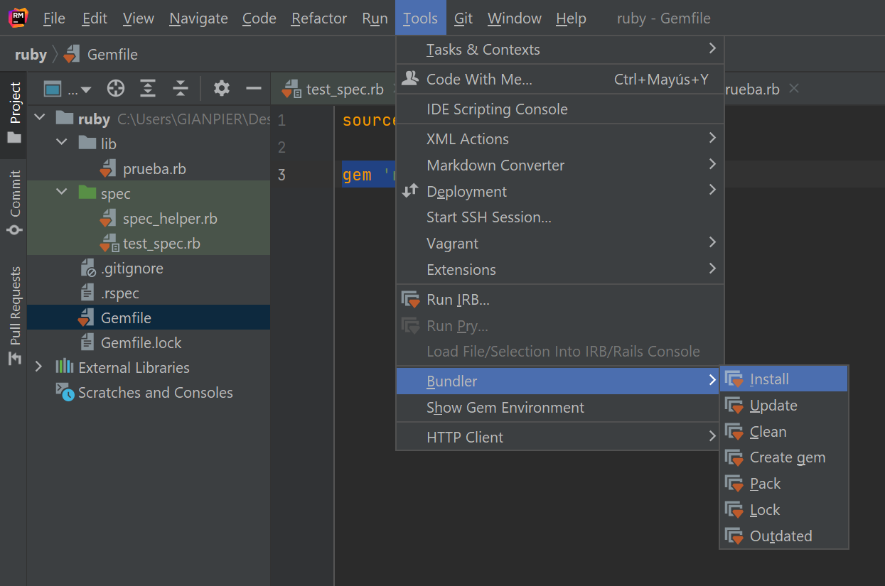

## RUBY

Preparación del ambiente para el TP

#### Las dependencias

La primera vez se podrá hacerse a través del IDE

Esto instalara la gema `bundler` o algo así y con esto puedes instalar/administrar las gemas. Te puede llegar a pedir algún parámetro opcional `no pongas nada solo dale a start/ok/enter o alo que sea verdecito`

Puedes acceder a la documentación del IDE en:  [Jetbrains](https://www.jetbrains.com/help/ruby/using-the-bundler.html?source=google&medium=cpc&campaign=10116875251&gclid=CjwKCAjwhaaKBhBcEiwA8acsHJo6gtg94tVnvaE8mLe--VaAK1Q3LC3vRFP0fDqsFUro5kgq0kQQqBoCYucQAvD_BwE#install_gems_local)

Después de instalar ya podrás correr el `test_spec.rb` y te debe quedar bien