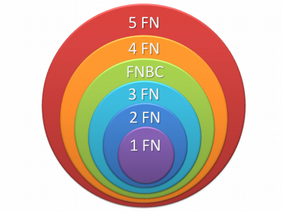
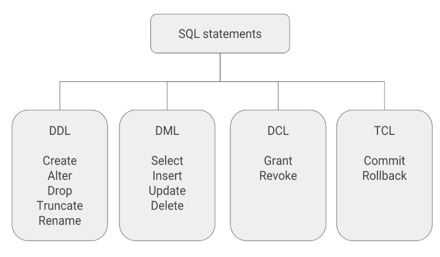

**Entidad** = Tabla

**Relación** → Verbo que conecta 2 entidades

**Diseño Lógico**: Mas Adentrado al Análisis y Diseño

**Diseño Físico** (DEFAULT)


#### DER : Diagrama Entidad Relación

Entidad, Atributos, Atributos multivaluados, Instancia de una entidad, Relaciones entre entidades


**Grado**: Cantidad de entidades que relaciona, una relación. **Tenemos las:** Unaria o Recursiva, Binario, N-aria (En si es un conjunto de muchas Relaciones Binarias, centradas hacia una Tabla)

**Cardinalidad**: 1 a 1, 1 a N, N a N

**Modalidad**: Opcional u Obligatoria

**Especialización o Generalización**: Entidad Supertipo / Entidad Subtipo


#### Normalización 

- Reducir la redundancia de datos, y por lo tanto, las inconsistencias.
- Facilitar el mantenimiento de los datos.
- Evitar anomalías en la manipulación de datos.
- Evitar anomalías en la manipulación de datos.

Cada forma normal introduce restricciones nuevas, donde *la primera restricción que aplica es cumplir la forma normal anterior.*




##### Primera Forma Normal

Una entidad que está en primera forma normal no puede tener campos repetitivos (arrays, mismo campo repetido n veces), o campos multivaluados.

##### Segunda Forma Normal

Una estructura de datos está en 2FN si y sólo si no hay dependencias funcionales entre los atributos claves(no hay dependencias parciales), y se satisface 1FN.

Los atributos no clave, deben depender únicamente de la **PK**

##### Tercera Forma Normal

Una estructura de datos está en 3FN si y sólo si no hay dependencias funcionales entre los atributos no claves(y se satisface 2FN)

Entre los <span style=" background:yellow;">atributos no clave </span>,no pueden depender de otro atributo no clave

*Casi todas las respuestas se resuelven extrayendo los atributos que no cumplen a una nueva tabla*


#### Desnormalización

Abecés des-normalizar, nos hace las búsquedas mas fáciles. Querys mas cortas, menor costo en la búsqueda, por ejemplo

````sql
TABLE Items{
	precio
}

TABLE Producto{
	precio
}
````

En este caso me conviene tener aun en `Items` el campo "precio" porque en el futuro podría cambiar el precio del "Producto" y desearíamos saber con que precio se vendió el `Item` (<u>Inflación</u>) 

Otros casos serian: Tener las tablas "Provincia" y "Ciudad" para calcular la ubicación de un "Cliente", Hoy en día con el **Código Postal** se podría solucionar y tener solamente una tabla, otro ejemplo seria el tener un campo `teléfono `y no una tabla para los `teléfono `


### Tablas

#### Constraints

##### <u>Integridad de Entidad</u>

<span style='color:blue'>PRIMARY KEY CONSTRAINT:</span> Puede estar compuesta por una o más columnas, y deberá representar unívocamente a cada fila de la tabla. No debe permitir valores nulos 

##### <u>Integridad Referencial</u>

<span style='color:blue'>FOREIGN KEY CONSTRAINT:</span> Puede estar compuesta por una o más columnas, y estará referenciando a la PRIMARY KEY de otra tabla.

##### <u>Integridad Semántica</u>

La integridad semántica es la que nos asegura que los datos que vamos a almacenar tengan una apropiada configuración y que respeten las restricciones definidas sobre los **dominios** o sobre los atributos.

````sql
DATA TYPE : INT, VARCHAR(20)
DEFAULT : Por defecto NULL a enos que se especifique
UNIQUE
NOT NULL : Asegura que una coluna contenga un valor durante una operación de INSERT o UPDATE
CHECK : c_estado in (1,2,3) Actúa tanto en el INSERT, como en el UPDATE.
````

<span style=" background:yellow;">Se considera el NULL como la ausencia de valor.</span>


<center><h1>SQL</h1></center>


SQL (por sus siglas en inglés *Structured Query Language*; en español **lenguaje de consulta estructurada**

**D<u>D</u>L : Lenguaje de <u>definición</u> de datos**

Manipula la estructura(definición) de la tabla (meta data)

````sql
CREATE ALTER DROP TRUNCATE
````

**D<u>M</u>L : Lenguaje de <u>manipulación</u> de datos**

````sql
SELECT INSERT UPDATE DELETE MERGE
````

**DCL : Lenguaje de <u>Control</u> de Datos**

Permite crear roles, permisos e integridad referencial, así como el control al acceso a la **base de datos**.

- **GRANT:** Usado para otorgar privilegios de acceso de usuario a la **base de datos**.
- **REVOKE:** Utilizado para retirar privilegios de acceso otorgados con el comando GRANT.

**TCL : Lenguaje de Control Transaccional**

Permite administrar diferentes transacciones que ocurren dentro de una **base de datos**.

- **COMMIT:** Empleado para guardar el trabajo hecho.
- **ROLLBACK:** Utilizado para deshacer la modificación que hice desde el último COMMIT.



