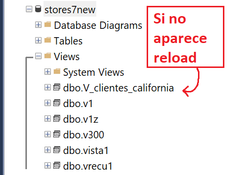

## Motor SQL Server

#### CREATE

````sql
CREATE TABLE ordenes (
	N_orden INT NULL ,
	N_cliente INT NULL ,
	F_orden DATETIME NULL ,
	C_estado SMALLINT NULL ,
	F_alta_audit TIMESTAMP NULL ,
	D_usuario VARCHAR(20) NULL 
);
````

##### ALTER

Considerar que pueden variar la sintaxis por motor **(\**)**

```sql
ALTER TABLE Customers
ADD Email varchar(255); # Agregar una columna
DROP COLUMN Email; # Borrar una columna
ALTER COLUMN column_name datatype; # Modificar una columna (**)
```


**DELETE**: Borra solo registros (-> no limpia el IDENTITY)

**DROP**: Borra la tabla(incluida la estructura), no queda nada

**TRUNCATE**:  Vacía la tabla(borra todos los registros) y Resetea la tabla (resetea el auto-increment)

````sql
DROP TABLE name_table -- La tabla desaperece
TRUNCATE TABLE name_tabla -- Aun existira la tabla
````


#### Secuencias

Los generadores de **secuencias** proveen una serie de <u>números secuenciales</u>, especialmente usados en <span style=" background:yellow;">entornos multiusuarios para generar una números secuenciales y únicos</span>

Los motores de base de datos proveen diferentes formas de implementar secuencias a través de:

- Propiedades de una columna (SqlServer, Mysql, DB2)
- Tipo de Dato de una columna (Informix, PostgreSQL)
- Objeto Sequence(Oracle, Informix, PostgreSQL, DB2, SqlServer)

Mirar el PDF, en este caso hablaremos específicamente de `SqlServer` 

Al insertar una fila en dicha tabla, el motor va a buscar el próximo nro. del más alto existente en la tabla. Seria el **AUTO_INCREMENTAL** (En SQLserver **IDENTITY**)

````sql
CREATE TABLE ordenes(
    N_orden int IDENTITY (1, 1), -- Primer valor 1, se incrementa de a 1
    N_clienteintNULL ,
    F_ordendatetimeNULL
);

INSERT INTO ordenes(n_cliente, f_orden) VALUES (114,'2020-03-03')
-- Si el N_orden maximo era 25. El nuevo registro insertado tendra PK=26
````

<span style='color:red'>Cuidado con las secuencias, cuando requerimos números consecutivos sin huecos.</span>

```sql
-- Puedo averiguar los parametros del IDENTITY desde la consola
SELECT IDENT_SEED('name_table')
SELECT IDENT_INCR('name_table')
-- Puedes activar/desactar el identitiy con 1 comando de consola
```


#### DEFINIR PK

````sql
CREATE TABLE ordenes (
	N_orden INT PRIMARY KEY,
	N_cliente INT,);

# Clave compuesta, fijate que al final la define
CREATE TABLE items_ordenes (
	N_orden INT,
	N_item SMALLINT,
	C_producto INT,
	Q_cantidad INT,
	PRIMARY KEY (n_orden, n_item) 
);
````

#### DEFINIR FK

````sql
CREATE TABLE items_ordenes (
	N_orden INT REFERENCES ordenes,
    N_item SMALLINT,
    PRIMARY KEY (n_orden, n_item) );
    
# FK Compuesta, fijate que al final la define
CREATE TABLE mov_stock (
    N_stock INT,
    C_movimientoSMALLINT,
    N_orden INT,
    N_itemSMALLINT,
    C_productoINT,
    Q_cantidadINT, # REFERENCES name_tabla [(atributos,..)]
    FOREIGN KEY (n_orden, n_item) REFERENCES items_ordenes
);

# SELF REFERENCING CONSTRAINT
CREATE TABLE empleados (
    N_empleado INTEGER PRIMARY KEY,
    D_Apellido VARCHAR(60),
    D_nombresVARCHAR(60),
    N_cuilNUMERIC(11,0),
    N_jefeINTEGER,
    FOREIGN KEY (n_jefe) REFERENCES empleados (n_empleado)
);
/*El motor no permitirá ingresar un empleado cuyo nro. de jefe no exista como número de empleado.
Lo que si permitirá es ingresar un nro. de jefe NULO.*/
````


#### <u>VIEW</u>

Nombre (o alias) que se le da a una query, esta query se **visualiza como una tabla** y cada vez que se consulta se (ejecuta la query)

<span style=" background:yellow;">No contiene datos almacenados (No aloca espacio de almacenamiento.)</span>

Las vistas se pueden utilizar para:
Suministrar un nivel adicional de **seguridad** restringiendo el acceso a un conjunto predeterminado de filas o columnas de una tabla.
Ocultar la complejidad de los datos. Simplificar sentencias al usuario.

Una **view** depende de las tablas a las que se haga referencia en ella, si se elimina una tabla todas las **views** que dependen de ella se borraran o se pasará a estado **INVALIDO**, dependiendo del motor. Lo mismo para el caso de borrar una **view** de la cual depende otra **view**. (depende del motor de BD)

Tener en cuenta ciertas **restricciones** para el caso de Actualizaciones:

- Si en la tabla existieran <span style=" background:yellow;">campos que no permiten nulos </span>y en **la view no aparecen**, los **inserts** fallarían.

- Si en la **view** no aparece la **primary key** los **inserts** podrían fallar.


Con la opción **WITH CHECK OPTION**, se puede actualizar siempre y cuando el <span style=" background:yellow;">checkeo de la opción en el **where** sea verdadero</span>

````sql
CREATE VIEW V_clientes_california
(codigo, apellido, nombre) -- Notar que se renombran los names de las columnas
AS
SELECT customer_num, lname, fname
FROM customer
WHERE state='CA'

-- Podriamos INSERTAR (En la VISTA)
INSERT INTO V_clientes_california
VALUES (999,'Martin','Mihura','FL') -- Y LO INSERTARA SI NO hay problemas de integridad(NULL aceptable en los otros campos de la tabla customer)

-- Si hacemos el SELECT count(*) de la V_clientes_california
Notaremos que no aparece este nuevo regitro, RECORDEMOS que la vista es la query(en tiempo de ejecucion) esa que tiene un WHERE state='CA' y la que insertamos es de (state='FL')

-- Hademos un Updatesobre el cliente 101 de California cambiando su estado a NewYork.
Y te deja, obviamente no podemos verlo en la query porque tiene el WHERE

-- Pero PARA
Esto no es SEGURO, puedo Manipular(INSERT,DELETE,UPDATE) registros mediante la VIEW. que actualmente no pueden ser accedidos a traves de la vista.


-- Aqui entra
WITH CHECK OPTION : realiza un chequeo de integridad de los datos a insertar o modificar, los cuales deben cumplir con las condiciones del WHERE de la vista.

CREATE VIEW V_clientes_california_WCK
(codigo, apellido, nombre,estado)
AS
SELECT customer_num, lname, fname,state
FROM customer
WHERE state='CA'
WITH CHECK OPTION

-- Ahora cuando se quiera operar algo que no cumpla con el WHERE te saldra un mensaje de error: The attempted insert or update failed because the target view either specifies WITH CHECK OPTION
````





#### <u>SNAPSHOTS</u>

Una FOTO de una TABLA en un determinado momento. Deben ser recalculadas o refrescadas cuando los datos de las tablas master cambian. <span style=" background:yellow;">Pueden ser refrescadas en forma manual, o a intervalos de tiempo definidos dependiendo el motor de BD.</span>

Por lo general son tablas sumarizadas(con funciones agregadas) → para toma de decisión

Se utilizan sobre todo en **Data Warehouse**, sistemas para soporte de toma de decisión


#### <u>INDICES</u>

Los índices son estructuras opcionales asociadas a una tabla.
La función de los índices es la de **permitir un acceso más rápido a los datos de una tabla**, se pueden crear distintos tipos de índices **sobre uno o más campos.**

Los índices son lógica y físicamente independientes de los datos en la tabla asociada. <span style=" background:yellow;">Se puede crear o borrar un índice en cualquier momento sin afectar a las tablas base o a otros índices.</span>


#### TIPOS DE INDICES

Indices B Tree

Indices B Tree +

Analogo al anterior con la diferencia de que tienen punteros entre nodos del mismo nivel


##### CARACTERÍSTICAS DIFERENCIADORAS PARA LOS ÍNDICES

**Unique**: Índice de clave única. Sólo admite una fila por clave.
**Duplicado**: Permite múltiples filas para una misma clave.
**Simple**: La clave está integrada por una sola columna.
**Compuesto**: La clave se compone de varias columnas.
						Las principales funciones de un índice compuesto son:
						Facilitar múltiples joins entre columnas
						Incrementar la unicidad del valor de los índices

```sql
CREATE INDEX ix_sample
on sample_table (a,b,c); -- Esto significa
-- A igualdad de valores de a ordena por b, 
-- A igualdad de valores de [a,b] ordena por c
```

(>>) EJ la PK seria del tipo UNIQUE mientras que si solo quiero **acceder mas rapido a un campo** que puede tener duplicados, no tendria problemas

##### <u>BENEFICIOS DE LA UTILIZACIÓN DE INDICES</u>

- Se le provee al sistema mejor perfomanceal equipo ya que no debe hacer lecturas secuenciales sino accede a través de los índices
- Asegura únicos valores para las filas almacenadas
-  <span style=" background:yellow;">cCuando las columnas que intervienen en un JOIN tienen índices</span> se le da mejor perfomancesi el sistema logra recuperar los datos a través de ellas
- Asegura el cumplimientode contraints y reglas de negocio. **Primary key, foreign keys, unique values**


##### <u>COSTO DE LA UTILIZACIÓN DE INDICES (Desventajas)</u>

**COSTO DE ESPACIO DE DISCO**
El primer costo asociado es el espacio que ocupa en disco, que en algunos casos suele ser mayor al que ocupan los datos

**COSTO DE PROCESAMIENTO Y MANTENIMIENTO**
El segundo costo es el de procesamiento, hay que tener en cuenta que <span style=" background:yellow;">cada vez que una fila es insertada o modificada o borrada, el índice debe estar bloqueado, con lo cual el sistema deberá recorrer y actualizar los distintos índices</span>


##### GUIA RESUMEN CUANDO DEBERIAMOS INDEXAR

Indexar columnas que intervienen en Joins
Indexar las columnas donde frecuentemente se realizan filtros
Indexar columnas que son frecuentemente usadas en orders by

**Evitar duplicación de índices**
	Sobre todo en columnas con pocos valores diferentes Ej: Sexo, Estado Civil, Etc.

**Verificar que el tamaño de índice debería ser pequeño comparado con la fila**
Tratar sobre todo en crear índices sobre columnas cuya longitud de atributo sea pequeña
No crear índices sobre tablas con poca cantidad de filas, no olvidar que siempre se recupera de a páginas. De esta manera evitaríamos que el sistema lea el árbol de índices

**Limitar la cantidad de índices en tablas que son actualizadas frecuentemente**
•Porque sobre estas tablas se estarán ejecutando Selects extras

**Tratar de usar índices compuestos para incrementar los valores únicos**
Tener en cuenta que si una o más columnas intervienen en un índice compuesto el optimizador podría decidir acceder a través de ese índice aunque sea solo para la búsqueda de los datos de una columna, esto se denomina “partial key search”

**Usando cluster index se agiliza la recuperación de filas**

Uno de los principales objetivos de la Optimización de bases de datos es reducir la entrada/salida de disco. Reorganizando aquellas tablas que lo necesiten, se obtendría como resultado que las filas serían almacenadas en bloques contiguos, con lo cual facilitaría el acceso y reduciría la cantidad de accesos ya que recuperaría en menos páginas los mismos datos.

##### CONSTRUCCIÓN DE ÍNDICES EN PARALELO

Medio que lo crea por partes (arma subarboles y luego los junta)

##### Motor SQL SERVER

SqlServer utiliza una estructura de ArbolB+.
Máxima cantidad de campos para la clave de un índice compuesto: 16.

```sql
-- Creación de un índice único y simple:
CREATE UNIQUE INDEX ix1_ordenes ON ordenes(n_orden);

-- Creación de Indice duplicado y compuesto.
CREATE INDEX ix2_ordenes ON ordenes (n_cliente, f_orden);
-- Notar que el quitamos la opcion UNIQUE (con esto se banca duplicados)
-- (n,f) pueden aparecer mas de una ves
-- (n,f) los campos en orden que quiero se guarden los datos

-- Creación de Indice clustered
CREATE CLUSTERED INDEX ix3_ordenes ON ordenes(N_orden);
```

##### Manejo del Load Factor

**FILLFACTOR**–Porcentaje de cada página del índice a ser dejado como espacio libre en su creación.
Por ej. Si el **FILLFACTOR**=20, <span style=" background:yellow;">en la creación del índice</span> se ocupará hasta el 80% de cada
nodo.

(Osea que en cada nodo hoja al mometno de crearlo deja 20% de las filas libres)

Ahora no te conviene mucho si el campo del indice te vienen valores cercanos ej (100,101,102,103) porque tendrias mas hojas y encima con filas libres

```sql
CREATE UNIQUE INDEX ix1_ordenes ON ordenes(N_orden)
WITH FILLFACTOR = 20;
```


##### MOTOR SQL SERVER

Indices Clustered


Hace que en la hoja tenga el dato posta y no la posicion a la tabla de datos

**Y Oracle? que usa?** Usa las **IOT**

Tablas organizadas por indice, y muy parecido a los Cluster de SQL server, quiza adicionando punteros entre nodos hojas


