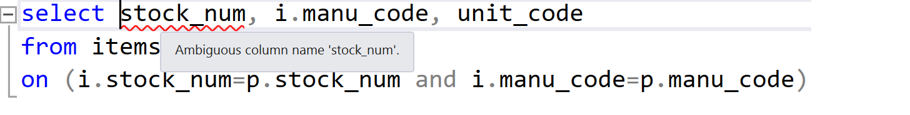
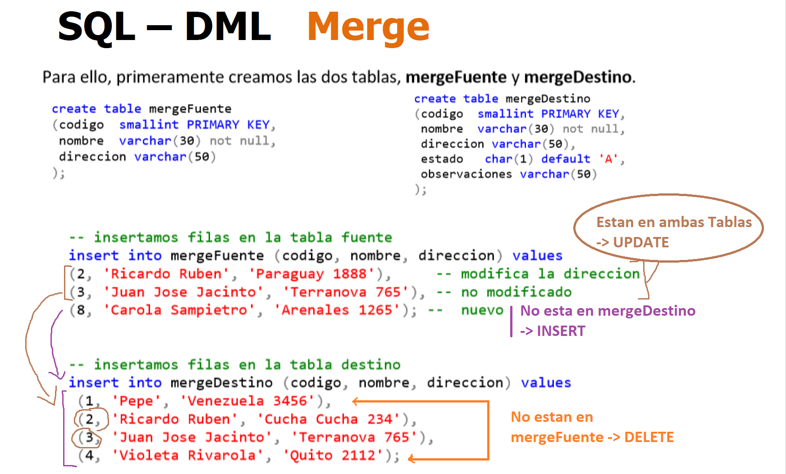

## COMANDOS

````sql
SELECT * | listade columnas
FROM nom_tabla| lista de tablas
WHERE condiciones ó filtros
GROUP BY columnas clave de agrupamiento
HAVING condiciones sobre lo agrupado
ORDER BY columnas clave de ordenamiento
````


#### INSERT

````sql
-- Se inserta una sola fila en la tabla
INSERT INTO ordenes (n_orden, n_cliente, f_orden) VALUES (117, 1O, '12-JAN-2013')
-- Obviamente que las columnas no incluidas en el INSERT deben aceptar valores NULL o tener un DEFAULT definido.

-- En caso que tenga todos los campos, podemos omitir especificar las columnas
INSERT INTO ordenes VALUES (117, 10, '12-JAN-2013')
-- EL motor de BD no aceptara datos erróneos, debido a que la cantidad de valores si difiere con la cantidad de columnas de la tabla.


-- Se insertan multiples filas en la tabla
INSERT INTO nom_tabla[(listade columnas)]
SELECT…
-- El select debe devolver una lista columnas similar a la que espera recibir el INSERT


IDENTITY
-- Al insertar una fila en una tabla con un atributo con la propiedad de IDENTITY, NO se debe incluir dicha columna en la lista de columnas, ni poner valor en la lista de valores.
-- EJEMPLO
TABLE empleados(
	empleadoId INT IDENTITY(1,1) PRIMARY KEY,
    nombre VARCHAR(60),
    CUIT BIGINT
);
INSERT INTO empleados (nombre, cuit) VALUES ('Pedrol',2569456213)
````

#### UPDATE

````sql
UPDATE nom_tabla
SET columna=valor [, columna=valor…])
[WHERE condiciones] -- CUIDADO si no se pone condición actualiza la TOTALIDAD DE LAS FILAS DE LA TABLA
````

#### DELETE

````sql
DELETE FROM nom_tabla
[WHERE condiciones] -- CUIDADO si no se pone condición ELIMINA la TOTALIDAD DE LAS FILAS DE LA TABLA
````

<span style="color:red;">**WARNING**</span> : Cuidado con la **Integridad Referencial** resguardada por las PK y las FK.


#### SELECT

````sql
SELECT stock_num, unit_price*1.15

# ALias de Columna o Etiqueta
SELECT stock_num, unit_price*1.15 NewPrice

# Concatenar columnas en una sola nueva columna de salida.
SELECT lname+', ' +fname apellidoYNombre

# Utilización de funciones especiales: ARITMETICAS, TRIGONOMETRICAS, FINANCIERAS, DE FECHA, DE STRINGS, Entre otras..
SELECT YEAR(order_date), MONTH(order_date), DAY(order_date), USER_NAME()
````

##### DISTINCT

````sql
SELECT customer_num
FROM orders
ORDER BY 1

# Listar valores únicos para una columna, ante una repetición de valores de esa columna.
SELECT DISTINCT customer_num
FROM orders
ORDER BY 1
````

#### Funciones Agregadas

````sql
SUM(columna)
COUNT(*) 		# cuenta todas las filas de la tabla
COUNT(columna)  # cuenta filas con dicha columna (NO NULA)
-- La sentencia "SELECT COUNT(*)" puede retornar más filas que la sentencia "SELECT COUNT(nombre_columna)" *

# Muestra la cantidad de Ordenes de Compra con fecha de pago No Nula
SELECT COUNT(paid_date) FROM orders

COUNT(DISTINCT columna)	 # Cuenta solo una vez cada valor.
MIN(columna)
MAX(columna)
SUM(columna)
AVG(columna)
````

Mucho ojo cuando se cuenta los valores **NO NULOS**

Son funciones que dado un conjunto de datos realizan operaciones agregadas <span style=" background:yellow;">devolviendo un único valor cómo resultado.</span>

````sql
SELECT MIN(orde_date) primeraCompra,
	   MAX(orde_date) ultCompra,
	   COUNT(*) cantOrdenes
FROM orders
# notar que todas las columnas deberan quedar agrupadas de alguna u otra forma
````


#### WHERE

````sql
WHERE condiciones | [AND, OR, NOT]
[NOT] LIKE			validar substrings
lname LIKE 'A%'			apellidos que comiencencon 'A'.
lname LIKE '%th%' 		apellidos que contenga'th' en cualquier parte.
lname LIKE 'A_ _ _' 	apellidos que comiencen con 'A' y tengan 4 letras
lname LIKE '[AE]%'		apellidos que comiencen con 'A'ó 'E'.
lname LIKE '[A-E]%' 	apellidos que comiencen entre la 'A' y la 'E'.


[NOT] BETWEEN		entre rango # WHERE order_num BETWEEN 1004 AND 1020
[NOT] IN			en lista de valores # WHERE customer_num IN (104,110,127)
IS [NOT] NULL 		es o no es nulo
````

#### ORDER BY

**Aclaracion**: En los numeros asendente es tan simple como 7, 8, 9

En el alfabero, ordenados asendentemente seria "a","b","d" 

````sql
# Ordenados asendentemento por 'city' y a igual 'ciudad', se ordena por customer_num también ascendente.
ORDER BY city, customer_num

# ASCENDENTE (default) -> Ordenados asendentemento por 'city' y en a igual DESC por 'customer_num'
ORDER BY city, customer_num DESC

# Se pueden poner números que indican la posición de la columna en la consulta, en lugar del nombre.
ORDER BY 4, 1 DESC
````

#### GROUP BY y HAVING

Esta clausula de agrupamiento es muy ponderosa en conjunto con la utilización de **funciones Agregadas.**

````sql
GROUP BY columnas clave de agrupamiento
HAVING condiciones sobre lo agrupado # OJO sobre los grupos
````

Veamos algunos ejemplos

````sql
SELECT customer_num, COUNT(order_num) cantOrdenes,
	MIN(order_date) primeraCompra, MAX(order_date) ultCompra
FROM orders
GROUP BY customer_num
````

Observamos los 17 clientes que compraron, de cada uno tenemos la cantidad de Ordenes de compra, la fecha de la primer y ultima compra.


````sql
GROUP BY YEAR(order_date), MONTH(order_date)
````

Observamos que rápidamente obtenemos la cant. De ordenes, la primer y ultima compra pero ahora agrupado por año y mes.


#### HAVING 

La Clausula HAVING actúa sobre los datos de las filas ya agrupadas y en general se le ponen condiciones con funciones agregadas

````sql
GROUP BY YEAR(order_date), MONTH(order_date)
HAVING count(*) >= 8
````

Basicamente: Es un **WHERE** en cada **Grupo**, en este caso se lee que Filtrare los grupos cuya cantidad de elementos sea mayor o igual a 8. <span style=" background:yellow;">Ahora que tengo solo los grupos que cumplen la condicion</span> , con las **funciones Agregadas** me devuelven un unico valor por **grupo**

Si en la columna tenemos un `count()` 


### JOIN

Se divide en dos:

````sql
INNER JOIN
-- El JOIN por defecto

OUTER JOIN    -- : Conformado por
- LEFT JOIN
- RIGHT JOIN
- FULL JOIN
````


##### INNER JOIN

Se realiza un macheo de las filas de una tabla que coincidan a través de un atributo o combinación de atributos con filas de otras tabla.
El **INNER JOIN** solo devolverá las filas que coincidan.

````sql
SELECT c.customer_num, fname,lname, order_num, order_date
FROM customer c INNER JOIN orders o
	ON(c.customer_num = o.customer_num)

# INNER JOIN (clave compuesta)
SELECT i.stock_num, i.manu_code
FROM items i JOIN products p
	ON (i.stock_num=p.stock_num and i.manu_code=p.manu_code)
````

(*) Cuando un atributo existe en mas de una tabla del **SELECT**, es obligatorio identificar de que tabla lo estamos tomando, utilizando el punto como separador (dot notation) tabla.columnao alias.columna.



Mas de dos tablas

````sql
SELECT i.stock_num, i.manu_code, unit_descr
FROM items i 
	JOIN products p ON (i.stock_num=p.stock_num and i.manu_code=p.manu_code)
	JOIN units u ON (p.unit_code=u.unit_code)
--  JOIN otra_tabla
# Puedes pensarlo como que juntas 2 tablas y luego a esta union le quieres joinear otra tabla asi siempre lo puedes pensar de a 2
````


##### OUTER JOIN

El Outerjoin, mostrara todas las filas de la tabla dominante macheen o no con la otra tabla.
El Outerpuede ser **LEFT**. (tabla izquierda dominante), **RIGHT** (tabla derecha dominante) o **FULL** (ambas tablas dominantes)

````sql
SELECT c.customer_num
FROM customer c 
	LEFT JOIN orders o ON (c.customer_num=o.customer_num)
-- Como el JOIN pero terminas con todas los registros de la tabla 'customer' aun que no hayan macheado con la otra tabla
-- Probablemente por que el valor del campo que hace el JOIN lo tiene en NULL
````


##### JOIN AUTO REFERENCIADO (SELF REFERENCING JOIN)

La tabla customer tiene un atricuto customer_num_referedBy, que nos indica quien fue el cliente que lo referencio.
Podríamos armar una consulta que nos diga nombre y apellido del referido y de quien lo referencio.

````sql
select c2.lname + ', ' + c2.fname Padrino, c1.lname + ', ' + c1.fname Referido
from customer c1
join customer c2 on (c1.customer_num_referedBy=c2.customer_num)
````


#### PRODUCTO CARTESIANO

El producto cartesiano es muy costoso para el motor de base de datos. En el caso que deban realizar alguno, deben tratar de achicar el working set lo máximo que puedan, proyectando solo las columnas que necesiten y condicionando con WHERE lo que pudiesen. **RECOMENDACIÓN NO LO UTILICEN**.

````sql
SELECT *
FROM customers c, orders o
/*	Clientes(12 cols) + Ordenes(10 cols) = 22 columnas
	28 clientes * 23 ordenes =644 filas
	Que pasaría si fuesen 1000 clientes con 100000 ordenes?
*/
````


### Tablas Temporales

Son tablas creadas cuyos datos son de existencia temporal.
No son registradas en las tablas del diccionario de datos.
No es posible alterar tablas temporarias. Si eliminarlas y crear los índices temporales que necesite una aplicación.
Las actualizaciones a una tabla temporal podrían no generar ningún log transaccional si así se configurara.

#### Tipos de Tablas

##### De Sesión (locales)

Son visibles sólo para sus creadores durante la misma sesión (conexión) a una instancia del motor de BD. <span style=" background:yellow;">Las tablas temporales locales se eliminan cuando el usuario se desconecta o cuando decide eliminar la tabla durante la sesión.</span>

##### Globales

Las tablas temporales globales están visibles para cualquier usuario y sesión una vez creadas. Su eliminación depende del motor de base de datos que se utilice.


#### Tipos de Creación

##### Creación Explícita.

Este tipo de creación se realizar mediante la instrucción <span style="color:blue;">**CREATE**</span>. De manera explícita se deberá crear la tabla indicando el nombre, sus campos, tipos de datos y restricciones.

````sql
CREATE TABLE #ordenes_pendientes( -- Notar el #
    N_orden INTEGER,
    N_cliente INTEGER,
    F_orden DATE,
    I_Total DECIMAL(15 , 2),
    C_estado SMALLINT,
) WITH NO LOG;

-- Rellenar
INSERT INTO #ordenes_Pendientes 
SELECT * FROM ordenesWHERE c_estado= 1
````

##### Creación Implícita

Se pueden crear tablas temporales a partir del resultado de una consulta SELECT.

````sql
-- Esto lo crea y lo rellena de datos
SELECT *
INTO #ordenes_Pendientes
FROM ordenes
WHERE c_estado = 1
````

<span style=" background:yellow;">Por qué utilizarlas?</span>

- Como <u>almacenamiento intermedio</u> de **Consultas Muy Grandes**
- Para <u>optimizar accesos a una consulta</u> varias veces en una aplicación
- Para almacenar resultados intermedios en una aplicación (<u>para actualizar o impactar a tablas reales de la BD solo en el final del procedimiento</u>)


#### MERGE

La sentencia MERGE se utiliza esencialmente para realizar procesamientos **batch** (migraciones, carga de datos, apareos, etc.) de tablas (La sintaxis y demás mirar en el PDF)

**BASICAMENTE TENEMOS 2 TABLAS**, (**mergeFuente** → **mergeDestino**) las columnas de la fuente deben estar también en las destino(esta puede tener mas) notar el sentido (→)

<span style=" background:yellow;">Muy importante las operaciones se hacen hacia la tabla **mergeDestino **</span>

Usando las PK que deben ser igual nombre, tenemos 3 casos **(UPDATE, INSERT, DELETE)**



Usando la PK en los registros definimos

| mergeFuente | mergeDestino | Operación    |
| ----------- | :----------- | :----------- |
| esta        | esta         | se actualiza |
| esta        | no esta      | inserta      |
| no esta     | esta         | se elimina   |

Como resultado final así quedaría la tabla **mergeDestino**

````sql
SELECT * FROM mergeDestino
codigo  nombre               direccion         estado   observacion
  2     'Ricardo Ruben'		 'Paraguay 1888'   A        NULL
  3     'Juan Jose Jacinto'	 'Paraguay 1888'   A        NULL
  8     'Carola Sampietro'	 'Paraguay 1888'   A        NULL
````

