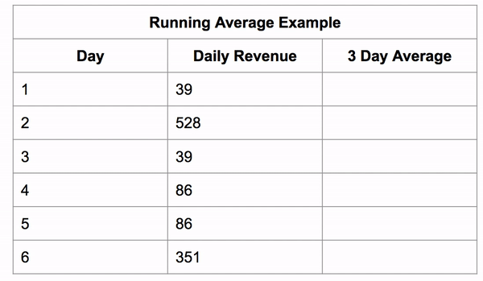

<div align="center">
	
	
	
	
</div>

## Enlaces interesantes

- [SQl windows functions](https://www.sqlshack.com/es/como-usar-las-funciones-de-windows-en-sql-server/)
- [Databricks sql/language-manual](https://docs.databricks.com/en/sql/language-manual/index.html)
- [WITH](https://modern-sql.com/feature/with)
- [window-functions con animaciones](https://dataschool.com/how-to-teach-people-sql/how-window-functions-work/)


## ¿Qué son las funciones de ventana?

Las funciones de ventana **crean una nueva columna** basada en cálculos realizados en un subconjunto o "ventana" de los datos. Esta **ventana** comienza en la primera fila de una columna particular y **aumenta de tamaño** a menos que restrinja el tamaño de la ventana.

> [!IMPORTANT]
> Si no quedo claro, la VENTANA es ese cuadro en color amarillo y borde en negrita

```sql
SELECT 'Day', 'Mile Driving',
SUM('Miles Driving') OVER(ORDER BY 'Day') AS 'Running Total'
FROM 'Running total mileage visual';
```


Aquí podemos verlo realizar una agregación de lo que hay al lado de la ventana.
La ventana crece en cada fila y, por lo tanto, agrega más y más datos, lo que le brinda una **agregación acumulada, en este caso un total acumulado**.

Si **restringimos** la ventana a 3 filas de alto, podemos obtener un promedio móvil de 3 días.

```sql
SELECT 'Day', 'Daily Revenue',
AVG('Daily Revenue') OVER(ORDER BY 'Day' ROWS 2 PRECEDING)
AS '3 Day Average' FROM 'Running Average Example';
```
