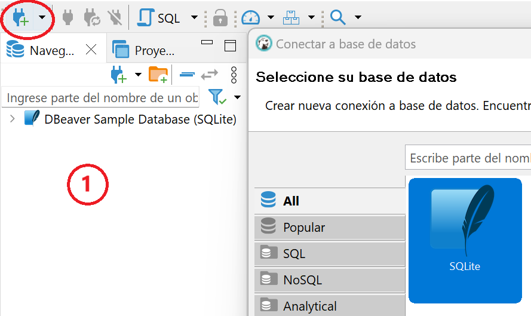
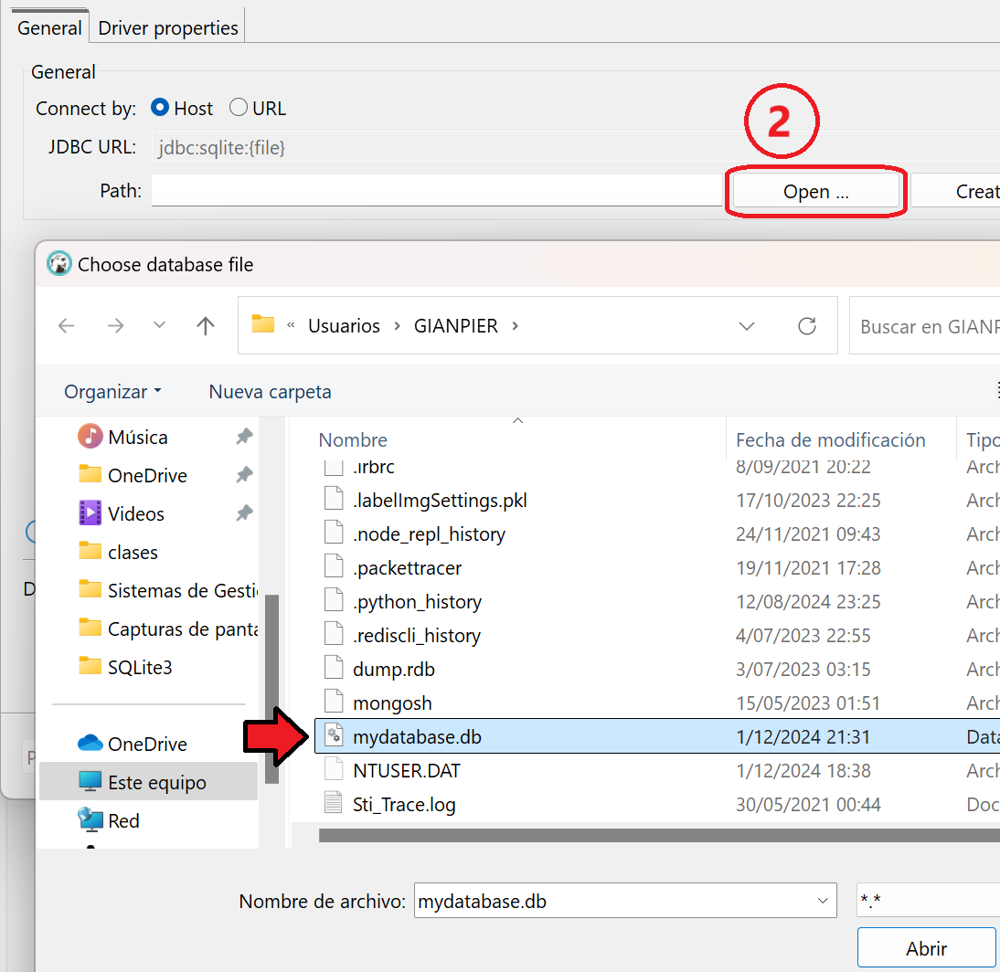
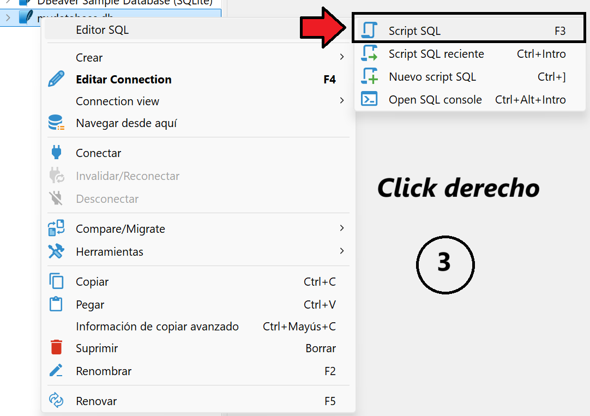
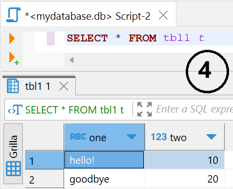

<div align="center">
	
</div>

SQLite 3 es una base de datos minimalista , o sea  `la base de datos es un arhivo`

Muy usado cuando quiero almacenar datos en SQL pero no cuento con mucho espacio como para descargarme SQL server, Oracle o MySQL . Muy usado en dispositivos móviles

## Instalación

### 1 - Archivo .ZIP p .MSI
Ir a la pagina de SQLite en `descargas` y buscar un archivo parecido a este `sqlite-tools-win32-x86-3310100.zip` , lo descomprimes y listo.

Una vez descargado vamos a moverlo a la carpeta `C:` y agregarlo al `path` como en la instalación de `mongodb`

> TIP : si no sabes a que me refiero ver los apuntes de mongodb para la instalación

Yo lo deje así en `C:` y lo agregue al `PATH` `C:\SQLite\sqlite-tools-win32-x86-3310100` para comprobar que tenemos `sqlite3` correctamente abrimos una consola y tipeamos `sqlite3 --version`, no importa en que dirección ya que debería estar en el `PATH`


La otra opcion es descargar el instalador, pero la version `.msi` en ese caso solo debes darle siguiente a todo y ya.


### 2 - Anaconda o .MSI
En este caso si ya intalaste anaconda, probablemente ya tienes sqlite por defecto, en lo que no necesitas hacer el proceso de instalacion.

Como mucho si deseas puedes agregar la ruta de anaconda al PATH o bien abrir el `promt de anaconda`
 

## Primeros Pasos en el CLI

> [!TIP]
> Ojo la ruta donde estoy, para salir del CLI (Ctrl + z)

Para iniciar:
- `sqlite3` : Entras a la interface de linea. 
- `sqlite3 mydatabase.db` : Lo mismo, pero esto creara(si no existe) o accederá al archivo `mydatabase.db`, donde se encuentra la base de datos. Recomiendo siempre esta opcion.


### Comandos Básicos

Cuando estoy dentro de una base

````sh
# Informacion de la base donde estoy
sqlite> .databases

# Crear una tabla
sqlite> create table tbl1(one text, two int);
sqlite> insert into tbl1 values('hello!',10);
sqlite> insert into tbl1 values('goodbye', 20);
sqlite> select * from tbl1;

# Mostrar las tablas de la base
sqlite> .tables 

# Para salir del CLI
sqlite> .exit
````

## GUI

### 1 - DB Browser
No podía faltar alguna interfaz Grafica.

Como en `mongodb:compas atlas` o en `python:spyder,jupyter,anaconda`tenemos una interfaz grafica llamada `SQLite Browser` descargan un archivo `.msi` parecido a este *DB.Browser.for.SQLite-3.11.2-win64.msi* seria como el estándar

> [!TIP]
> En la pantalla de instalación, en la sección **Shortcuts**  en la parte (DB Browser SQLite) marcar la palomita

### 2 - DBeaver

<p align="justify-all" width="100%">
    
	
	
	
</p>


### En Python

Python tiene incorporado un modulo para trabajar con esta **base de datos**, ósea no se necesita instalar módulos externos ya viene de fabrica

````python
import sqlite3
# Nombre de la base de datos si existe de lo contrario lo crea
conexion = sqlite3.connect("mydatabase.db")

#Para ejecutar sentencias sql
cursor = conexion.cursor()
cursor.execute("CREATE TABLE personas(nombre TEXT,apellido TEXT,edad INTEGER)")

#Para comitear los cambios
conexion.commit()
conexion.close()
````

