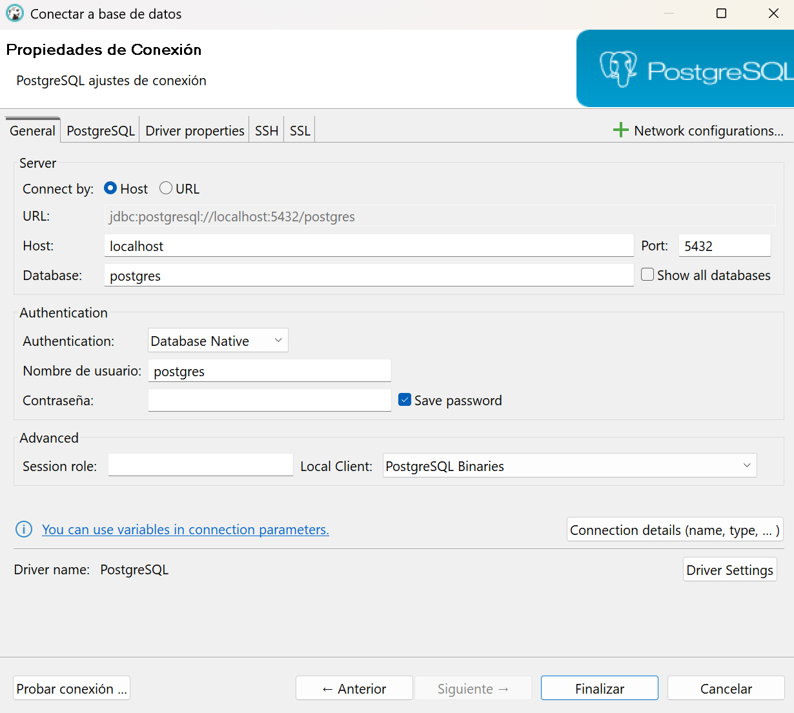

# Postregd + Docker

Descargar y usar Postreg a traves de Docker

```sh
# Descargar la imagen
$ docker pull postgres

# Error, necesita inicialisar con un usuario y pass
$ docker run postgres

# Para usamos el flag (-e) para especificar "variables de entorno"
# Esto dejara la consola corriendo del postgres
$ docker run -e POSTGRES_PASSWORD=password postgres
```

Abriendo otra consola, usandolo como cliente

```sh
# Para ver el nombre del contenedor
$ docker ps

$ docker exec -it xenodochial_williamson bash
root@e6c88ef11296:/# psql -U postgres --password
Password:
psql (17.2 (Debian 17.2-1.pgdg120+1))
Type "help" for help.

postgres=# CREATE DATABASE test;
postgres=# SELECT 1+1 as result;
 result
--------
      2
(1 row)
```

Borramos los contianerns, creemos uno con mas parametros
**El (-d) es el modo deteach**, que deja ejecutando el comando en segundo plano, mientras me devuelve el control del cmd

```sh
> docker run -e POSTGRES_USER=gian -e POSTGRES_PASSWORD=password -e POSTGRES_DB=mygiandb -d postgres
```
Lo Borramos de nuevo, epa no me deja :( primero hay que apagarlo antes de borrarlo. docker stop y luego docker rm

Ahora si
Lo agrego un alias al container con la variable (--name)
```sh
> docker run --name gian-conta-docker -e POSTGRES_USER=gian -e POSTGRES_PASSWORD=password -e POSTGRES_DB=mygiandb -d postgres

> docker exec -it gian-conta-docker bash
root@e6c88ef11296:/# psql -U  gian --db mygiandb
```

Borremos el container de nuevo.
Un parametro extra, para que nuestras aplicaciones externas puedan acceder al container de POSTGRES, el **PUERTO**

```sh
> docker run --name gian-conta-docker -e POSTGRES_USER=gian -e POSTGRES_PASSWORD=password -e POSTGRES_DB=mygiandb -p 5432:5432 -d postgres
```

### Dbeaver

Para conectarme a travez de Dbeaver, le doy a conexion nueva:



Rellenando los campos.


Y ya esta, puedo usar tanto el CLI de Dbeaver o el de CMD ambos te retornaran lo mismo

